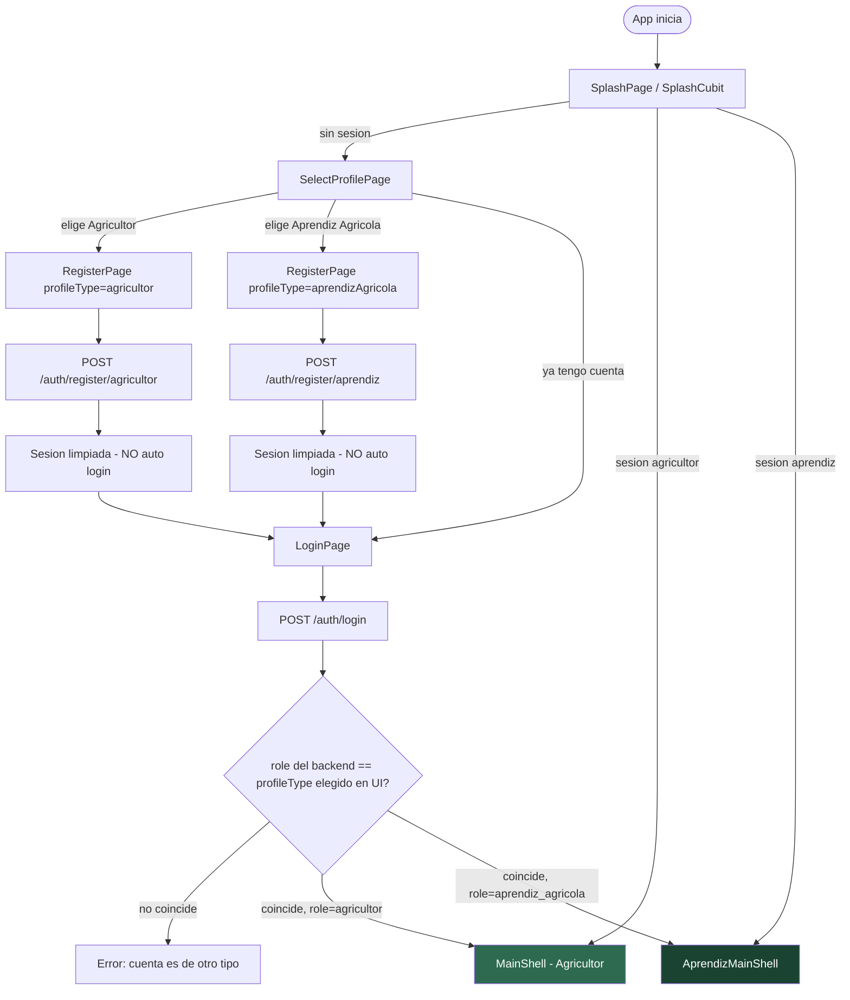
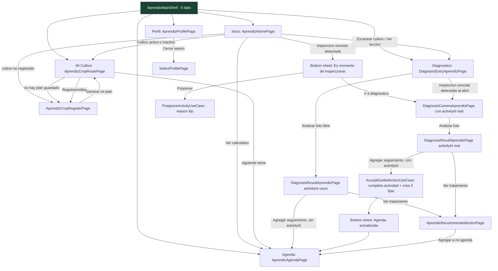
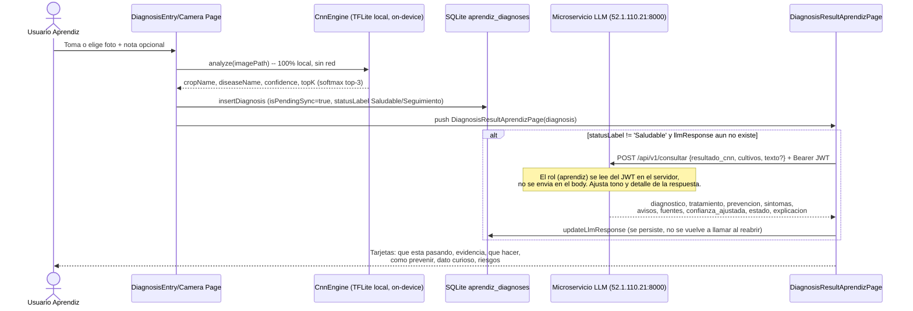
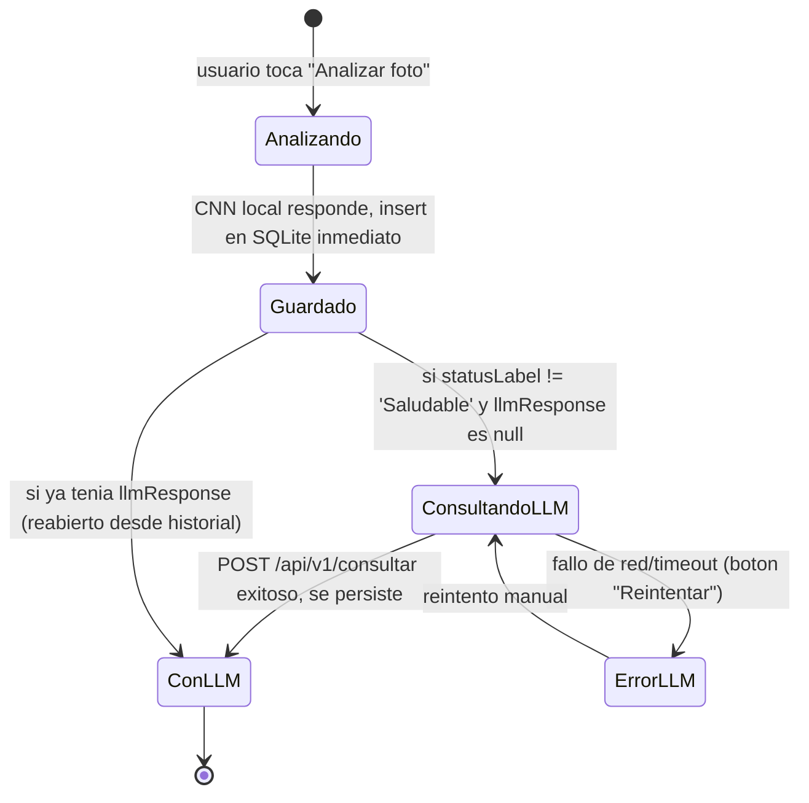

# README — Perfil Aprendiz Agrícola (AgroGraph-MAS)

> Documento técnico-funcional generado a partir de una lectura exhaustiva del código fuente en `lib/features/aprendiz/`, `lib/features/login/`, `lib/features/agricultor/diagnosis/` (compartido) y `lib/core/`. Pensado para el equipo que construirá el modelo LLM que atenderá a los usuarios del perfil **Aprendiz**. No es un documento de diseño ni de intención de producto: describe el comportamiento **real** implementado en el código, incluyendo lo que está roto, mockeado o sin conectar.

---

## 1. Introducción

AgroGraph-MAS es una app Flutter (Clean Architecture + BLoC/Cubit + GetIt) con dos perfiles de usuario mutuamente excluyentes, elegidos en el registro y validados contra el rol real devuelto por el backend en cada login:

- **`agricultor`** — usuario con parcelas reales, flujo "productor experimentado".
- **`aprendiz_agricola`** — usuario en aprendizaje, flujo guiado paso a paso. **Este es el perfil que documenta este archivo.**

El perfil Aprendiz vive casi en su totalidad bajo `lib/features/aprendiz/`, organizado en **6 módulos independientes** (cada uno con su propia inyección de dependencias): `inicio`, `diagnostico`, `cultivo`, `agenda`, `perfil`, `historial`, más un `shell` que los une en un `BottomNavigationBar` de 5 tabs (Historial no tiene tab — ver Hallazgos).

El módulo de diagnóstico del Aprendiz **no es autónomo**: reutiliza directamente entidades y lógica del perfil Agricultor (`lib/features/agricultor/diagnosis/`) — el motor CNN local, la entidad `DiagnosisEntity`, la entidad `LlmResponseEntity` y todo el cliente del microservicio LLM son código compartido, no una reimplementación.

---

## 2. Objetivo del perfil Aprendiz

Según el propio dominio (`ProfileType.aprendizAgricola` displayName "Aprendiz Agrícola", descripción en `select_profile_page.dart`: *"Estoy empezando y quiero que la app me guíe paso a paso"*), el objetivo de este perfil es:

1. Guiar a un usuario sin experiencia agrícola a través de un **ciclo de cultivo simulado/educativo** (registro de un cultivo de práctica, plan de actividades semanal, seguimiento).
2. Enseñar a diagnosticar problemas fitosanitarios mediante fotos, con **explicaciones educativas** (no solo "qué hacer", también "por qué" — el propio backend LLM personaliza el tono: *"Técnica y educativa. Menciona agente causal y porqués"* para `rol=aprendiz`, contra *"Lenguaje simple, directo, práctico"* para `rol=agricultor` — ver `consumir_servicio_LLM.md`).
3. Dar seguimiento a su progreso de aprendizaje mediante un sistema de nivel/XP/racha gamificado.

**Importante para el LLM**: el Aprendiz no gestiona parcelas reales de producción — gestiona **un único cultivo de práctica a la vez** (un solo `CropPlanEntity` guardado, sin lista de parcelas como sí tiene el Agricultor).

---

## 3. Arquitectura de la feature

Clean Architecture estricta por módulo: `domain/{entities,repositories,usecases}`, `data/{models,datasources,repositories}`, `presentation/{bloc,pages,widgets}`, más `dependency_injection/<modulo>_injection_container.dart`. El contenedor global (`lib/core/di/injection_container.dart`, función `_initAprendizFeature()`) los inicializa en este orden fijo, porque hay dependencias cruzadas reales entre módulos:

```
1. Agenda      (independiente)
2. Cultivo     (independiente) — expone GetSavedCropPlanUseCase, GetCropHealthIndicatorUseCase,
                                  GetDueInspectionActivityUseCase, CompleteActivityUseCase,
                                  CropPlanRepository — consumidos por Diagnostico, Perfil e Inicio
3. Diagnostico (consume Cultivo.CompleteActivityUseCase + CropPlanRepository)
4. Perfil      (consume Auth.GetCurrentUserUseCase + Cultivo.GetSavedCropPlanUseCase +
                Diagnostico.GetDiagnosisHistoryAprendizUseCase)
5. Inicio      (consume Auth + Cultivo + Diagnostico + Agenda — es el agregador más grande)
6. Historial   (independiente, sin consumidores ni consumidos — ver Hallazgos)
```

**Persistencia local**, cada módulo con su propio almacén (sin cajas compartidas, salvo una excepción documentada como deuda técnica):

| Módulo | Almacén | Nombre | Notas |
|---|---|---|---|
| Cultivo | Hive `Box<String>` | `aprendiz_cultivo_box` | 1 plan cacheado como JSON |
| Agenda | Hive `Box<String>` | `aprendiz_agenda_box` | 1 overview cacheado como JSON; **auto-siembra datos mock si está vacío** |
| Perfil | Hive `Box<String>` | `aprendiz_perfil_box` | solo el flag `offlineModeEnabled` |
| Diagnóstico (historial de diagnósticos) | SQLite | `aprendiz_diagnosis.db`, tabla `aprendiz_diagnoses` | aislada del perfil Agricultor y por `user_id` |
| Historial de cultivo (`historial`) | Hive `Box<String>` | reutiliza `'authBox'` (⚠️ ver Hallazgos) | clave `CACHED_CROP_HISTORY` |

**Backends remotos involucrados**:

| Servicio | Base URL | Usado por | Estado real |
|---|---|---|---|
| Microservicio de Usuarios | `http://174.129.218.190/api/v1` | Login/registro/perfil, y también los endpoints (probablemente inexistentes) de `aprendiz/crop-plan`, `aprendiz/agenda`, `aprendiz/history`, `users/me/progress` | Auth **real y documentado**. El resto son rutas con TODO explícito en el código, no confirmadas por el backend. |
| Microservicio LLM/RAG | `http://52.1.110.21:8000` | Explicación de diagnóstico (`POST /api/v1/consultar`) | **Real y documentado** (`consumir_servicio_LLM.md`). Es el único backend "de negocio" del Aprendiz que funciona hoy. |
| Microservicio de Cultivos (catálogo) | `http://3.217.217.227/api/v1` | **Solo el perfil Agricultor** (`features/agricultor/parcels`) | Real, pero el módulo `aprendiz/cultivo` **no lo usa** — ver Hallazgo #1, es la inconsistencia arquitectónica más importante de todo el feature. |

---

## 4. Flujo completo paso a paso

1. **Arranque de la app** → `SplashPage` → `SplashCubit.checkSession()` (mínimo 2.5 s de splash) → `GetSavedSessionUseCase` valida sesión cacheada en Hive (incluye refresh de token si hace falta).
2. Según el resultado:
   - Sin sesión válida → `SelectProfilePage`.
   - Sesión válida y `user.role == 'agricultor'` → `MainShell` (perfil Agricultor).
   - Sesión válida y `user.role == 'aprendiz_agricola'` → **`AprendizMainShell`** (entra directo, sin pedir login de nuevo).
   - Rol desconocido/admin → `SelectProfilePage`.
3. **`SelectProfilePage`** (solo si no hay sesión): dos tarjetas, "Agricultor" y "Aprendiz Agrícola". Elegir una navega a `RegisterPage(profileType)`.
4. **Registro** (`RegisterPage`): formulario único parametrizado por `profileType`. Envía `POST /auth/register/aprendiz` (fullName, username, password, email?, phone?). **El registro NO inicia sesión** — por diseño explícito (comentario en `auth_bloc.dart`): se limpia la sesión recién creada (invalida tokens en servidor) y se emite `AuthRegistrationSuccess`, la UI redirige a `LoginPage`.
5. **Login** (`LoginPage`): `POST /auth/login` (username, password). El backend no distingue login por perfil — el cliente valida que el `role` devuelto coincida con el `profileType` que el usuario eligió en la UI; si no coincide, error explícito ("Esta cuenta es de tipo 'X'. Selecciona el perfil correcto") — **nunca hay acceso cruzado silencioso**.
6. Login exitoso con `role='aprendiz_agricola'` → `AuthAuthenticated(profileType: aprendizAgricola)` → `login_page.dart` navega (`pushReplacement`) a **`AprendizMainShell`**.
7. **`AprendizMainShell`**: `IndexedStack` de 5 páginas + barra inferior custom (`_StitchNavBar`, verde con acento naranja `AppColors.aOrangeAccent` en el tab activo):
   - Tab 0 **Inicio** → `AprendizHomePage`
   - Tab 1 **Diagnóstico** → `DiagnosisEntryAprendizPage`
   - Tab 2 **Mi Cultivo** → `AprendizCropRoutePage`
   - Tab 3 **Agenda** → `AprendizAgendaPage`
   - Tab 4 **Perfil** → `AprendizProfilePage`
8. Desde aquí el usuario se mueve libremente entre tabs. No hay un "onboarding forzado" a nivel de shell: si el usuario no tiene cultivo registrado, cada pantalla lo detecta individualmente y muestra su propio prompt/CTA de "Registrar cultivo" (no hay una redirección automática global como describe el documento de diseño `flujo_aprendiz.md`).
9. **Registro de cultivo** (si no existe uno guardado): formulario de 3 pasos (cultivo, fecha de siembra, lugar de práctica) → intenta crear el plan en el backend (endpoint no confirmado) → si falla o está offline, crea un plan local vacío (`activities: []`, `isPendingSync: true`).
10. **Diagnóstico**: foto → CNN local (TFLite, en el propio dispositivo) → se guarda inmediatamente en SQLite → se muestra resultado → si hay enfermedad, se consulta automáticamente al LLM (`POST /api/v1/consultar`) → respuesta se persiste sobre el mismo registro SQLite.
11. El usuario puede "agregar seguimiento" desde el resultado del diagnóstico, lo que (solo si venía de una inspección programada real) completa esa actividad y genera **3 actividades nuevas fijas** (no derivadas del diagnóstico real) en el plan de cultivo local.
12. El ciclo se repite: Agenda/Mi Cultivo muestran actividades pendientes, el usuario las completa o (en teoría, sin UI) las pospone, y el Home agrega todo en un dashboard.

---

## 5. Diagrama del flujo

### 5.1 Entrada y autenticación



### 5.2 Shell y navegación principal del Aprendiz



### 5.3 Secuencia del ciclo de diagnóstico (CNN local + LLM remoto)



---

## 6. Pantallas involucradas

| # | Pantalla (archivo) | Qué hace | Datos que recibe | Acciones del usuario | Llamadas al backend | Efecto en estado |
|---|---|---|---|---|---|---|
| 1 | `SelectProfilePage` | Elegir Agricultor vs Aprendiz | ninguno | Tap en tarjeta | ninguna | navega a `RegisterPage` |
| 2 | `RegisterPage` | Alta de cuenta | `ProfileType` | Llenar formulario, submit | `POST /auth/register/aprendiz` | crea usuario, cierra sesión, va a Login |
| 3 | `LoginPage` | Autenticación | ninguno | usuario/contraseña | `POST /auth/login` | `AuthAuthenticated` → `AprendizMainShell` |
| 4 | `AprendizHomePage` (Inicio) | Dashboard agregador | overview compuesto de Auth+Cultivo+Diagnóstico+Agenda | pull-to-refresh, tap en secciones, responder modal de inspección | ninguna directa (delega en use cases de otros módulos) | navega a las demás pantallas |
| 5 | `DiagnosisEntryAprendizPage` (Diagnóstico) | Tomar/elegir foto y ver historial | ninguno al entrar (chequea inspección vencida) | tomar foto, elegir galería, escribir nota, "Analizar foto"; tab "Mis diagnósticos" | CNN local (no red); lista historial vía SQLite | crea diagnóstico, navega a resultado |
| 6 | `DiagnosisCameraAprendizPage` | Variante de cámara para inspección **programada** | `weekNumber`, `activityId` reales | mismo flujo de foto | igual que arriba | igual, pero `activityId` no vacío ⇒ habilita generación de 3 actividades al aceptar |
| 7 | `DiagnosisResultAprendizPage` | Muestra diagnóstico CNN + explicación LLM | `DiagnosisEntity`, `activityId` | Guardar (cosmético), Agregar seguimiento, Ver tratamiento | `POST /api/v1/consultar` (si aplica) | persiste `llmResponse`; puede crear actividades |
| 8 | `AprendizRecommendedActionPage` | Muestra tratamiento/prevención en texto plano | `diseaseName`, `cropName`, `LlmResponseEntity?` | "Agregar a mi agenda" (solo navega, no crea nada), "Volver" | ninguna | ninguno real |
| 9 | `AprendizCropRegisterPage` (Mi Cultivo → registro) | Formulario de alta de cultivo de práctica | ninguno | seleccionar cultivo (grid 5 opciones), fecha de siembra, lugar de práctica | `POST /aprendiz/crop-plan` (no confirmado en backend) | crea/reemplaza el plan guardado |
| 10 | `AprendizCropRoutePage` (Mi Cultivo) | Muestra plan activo: semana actual, etapa, próxima tarea | `CropPlanEntity` | "Ver tarea de hoy" → Agenda; CTA de registro | `GET /aprendiz/crop-plan` (no confirmado) | ninguno, solo lectura |
| 11 | `AprendizAgendaPage` | Calendario semanal + tarea del día + próximas | `AgendaOverviewEntity` | seleccionar día, navegar mes, "Marcar como completada" | `GET/POST /aprendiz/agenda/...` (no confirmado) | completa actividades |
| 12 | `AprendizProfilePage` | Perfil, progreso gamificado, ajustes, cuenta | `AprendizProfileOverviewEntity` | toggle "Modo sin conexión" (inerte), cerrar sesión, "eliminar cuenta" (stub) | `GET /users/me/progress` (no confirmado, cae a cálculo local) | logout real; el resto es cosmético |
| 13 | `CropHistoryPage` (Historial) | Timeline de eventos del cultivo | `List<CropEventEntity>` | ninguna (solo scroll) | `GET /aprendiz/history` (no confirmado) | ninguno — **pantalla sin punto de entrada en la navegación real** (ver Hallazgos) |

---

## 7. Componentes principales

Por módulo, los "widgets" reutilizables más relevantes (todos en `presentation/widgets/`):

- **Inicio**: `HomeHeader`, `HomeCropCatalogSection`, `HomeScanCtaCard`, `HomeDailySummarySection`, `HomeCropStatusCard`/`HomeCropStageCard` (mutuamente excluyentes según si hay plan), `HomeRecommendationCard`, `HomePhytosanitaryAlertCard`, `HomeFunFactCard`, `HomeTodayTasksSection`, `HomeRecentActivityList`, `HomeNoticesCard`, `HomeSectionSkeleton` (loading).
- **Diagnóstico**: `DiagnosisCaptureArea`, `DiagnosisTipsCard`, `DiagnosisDescriptionField`, `DiagnosisResultPhotoCard`, `DiagnosisResultPlantCard`, `DiagnosisResultDiagnosisCard`, `DiagnosisHealthyResultCard`, `DiagnosisExplanationCard`, `DiagnosisEvidenceCard`, `DiagnosisChecklistCard` (reutilizado para "qué hacer" y "cómo prevenir"), `DiagnosisFunFactCard`, `DiagnosisRiskCard`, `DiagnosisNextStepCard`, `DiagnosisLlmStatusCard` (loading/error), `DiagnosisHistoryList`/`DiagnosisHistoryCard`.
- **Cultivo**: `CultivoSummaryCard`, `CultivoTodayStageCard`, `CultivoNextTaskRow`, `CultivoSelectableGridCard` (grid de cultivos y de lugares), `CultivoDateField`, `CultivoHarvestEstimateChip`, `CultivoRegisterCta`.
- **Agenda**: `AgendaMonthCalendar` (en realidad muestra una semana, ver Hallazgos), `AgendaCropSummaryRow`, `AgendaTodayStageCard`, `AgendaUpcomingSection`/`AgendaUpcomingTaskTile`.
- **Perfil**: `ProfileAvatarHeader`, `ProfileProgressCard`, `ProfileActivitySummaryCard`, `ProfileWeeklyGoalCard`, `ProfileRecommendationCard`, `ProfileSettingsCard`/`ProfileSettingsRow`/`ProfileSettingsSwitchRow`, `ProfileSubscriptionCard`, `ProfileDangerZone`.
- **Historial**: `_HistoryList`/`_HistoryRow` (privados de `crop_history_page.dart`).

---

## 8. "Hooks" utilizados (Cubits/BLoCs y casos de uso reutilizables)

Flutter/BLoC no tiene "hooks" en el sentido de React; el equivalente funcional son los **Cubits/BLoCs de cada módulo** (unidades de estado reutilizables) y los **casos de uso compartidos entre módulos**:

| Cubit/BLoC | Módulo | Responsabilidad |
|---|---|---|
| `AprendizHomeBloc` | Inicio | Carga overview agregado, maneja modal de inspección vencida, posponer |
| `CultivoBloc` | Cultivo | Carga/registra plan de cultivo |
| `DiagnosisCameraAprendizCubit` | Diagnóstico | Ejecuta análisis CNN |
| `DiagnosisResultAprendizCubit` | Diagnóstico | Acepta acción guiada (crea actividades), guarda respuesta LLM |
| `LlmDiagnosisCubit` (compartido con Agricultor) | Diagnóstico | Llama/cachea la respuesta del LLM |
| `AprendizDiagnosisHistoryCubit` | Diagnóstico | Lista historial de diagnósticos del usuario |
| `AgendaBloc` | Agenda | Calendario, completar/posponer actividades |
| `AprendizProfileBloc` | Perfil | Overview de perfil + toggle modo offline |
| `CropHistoryBloc` (en realidad un `Cubit`, mal nombrado) | Historial | Carga timeline (solo lectura) |
| `AuthBloc` / `SplashCubit` (compartidos, `login/auth`) | Global | Sesión, login, logout, registro |

**Casos de uso cross-módulo** (el equivalente a "hooks compartidos" en esta arquitectura): `GetCurrentUserUseCase`, `GetSavedCropPlanUseCase`, `GetDueInspectionActivityUseCase`, `GetCropHealthIndicatorUseCase`, `CompleteActivityUseCase`, `GetDiagnosisHistoryAprendizUseCase`, `GetAgendaOverviewUseCase` — todos se inyectan en más de un módulo (ver tabla de orden de inicialización, sección 3).

---

## 9. Servicios y APIs

### 9.1 Autenticación (real, documentada — `CONSUMO_API_Usiarios.md`)

- `POST /auth/register/aprendiz` — alta pública, asigna `role=aprendiz_agricola`.
- `POST /auth/login` — válido para los 3 roles, el cliente valida el rol contra el perfil elegido en la UI.
- `POST /auth/refresh`, `POST /auth/logout` — rotación de tokens y blacklist en Redis, manejado automáticamente por `AuthInterceptor`.
- `GET/PUT /users/me` — perfil básico (no usado activamente por las pantallas del Aprendiz descritas aquí, salvo indirectamente vía `GetCurrentUserUseCase`).

### 9.2 LLM / RAG (real, documentado — `consumir_servicio_LLM.md`)

- `POST /api/v1/consultar` (host `52.1.110.21:8000`) — único endpoint de "inteligencia" que el Aprendiz consume de verdad. Recibe el resultado de la CNN local + texto opcional del usuario; el **rol se toma del JWT**, no se envía en el body; el backend adapta el tono de la respuesta (técnico/educativo para aprendiz vs. simple/práctico para agricultor).
- Timeout largo configurado en cliente: `llmTimeoutMs = 180000` (3 min) — el LLM corre sobre Ollama y puede tardar.

### 9.3 Endpoints "Aprendiz" propios — **NO confirmados por el backend**

Todos están marcados con `// TODO` explícito en `lib/core/network/api_endpoints.dart`, y ninguno aparece documentado en `CONSUMO_API_Usiarios.md` ni en `microservicio_cultivos.md`. Están apuntando al **host del microservicio de Usuarios** (`174.129.218.190`), cuya propia documentación dice textualmente en su sección "Fuera de alcance": *"Gestión de Parcelas y Terrenos... Agendas de Tratamiento o 'Rutas del Cultivo'"* no son responsabilidad de ese servicio.

| Endpoint | Usado por | Estado |
|---|---|---|
| `GET/POST /aprendiz/crop-plan` | Cultivo | TODO, probablemente inexistente |
| `GET /aprendiz/crop-health` | Cultivo (indicador de salud) | TODO, sin fallback offline (si falla, error de red directo) |
| `POST /aprendiz/crop-plan/activities/{id}` | Cultivo (completar/posponer) | TODO |
| `GET/POST /aprendiz/agenda`, `.../activities/{id}/complete`, `.../postpone` | Agenda | TODO explícito: "reemplazar por la URL real cuando el backend exponga el módulo" |
| `GET /aprendiz/history` | Historial | TODO explícito: "Documentar en backend (Pieza 2)" |
| `GET /users/me/progress` | Perfil (nivel/XP/racha) | TODO explícito, siempre cae a cálculo local |

**Consecuencia práctica**: hoy, todo lo que no sea Login/Registro/Perfil-básico y la consulta LLM funciona en la app **gracias a los fallbacks locales** (caché Hive, SQLite, cálculo en cliente, o datos sembrados/hardcodeados), no porque haya un backend de negocio real detrás. Ver sección 15 (Hallazgos).

### 9.4 CNN local (real, on-device, sin red)

`CnnEngine.analyze()` — TFLite (`assets/models/best.tflite`, MobileNetV3-Large), 33 clases (`assets/models/class_mapping.json`), incluye clases custom `Calabaza_*` y `Frijol_*` además de clases del dataset PlantVillage (Corn, Potato, Tomato, etc.). Preprocesa a 224×224 NCHW normalizado ImageNet en un isolate, corre inferencia en el hilo principal, aplica softmax y devuelve top-3.

---

## 10. Modelos de datos

### `DiagnosisEntity` (compartida con Agricultor, `agricultor/diagnosis/domain/entities/diagnosis_entity.dart`)
`id, diseaseName, cropName, confidence(double), imagePath?, diagnosedAt, isPendingSync, treatmentProgress?, treatmentStep?, statusLabel('Saludable'|'Seguimiento'), topK(List<TopKPrediction>), llmResponse?(LlmResponseEntity), parcelId?, parcelName?`

### `LlmResponseEntity` (compartida)
`diagnostico, tratamiento, prevencion, fuentes(List<String>), confianzaAjustada(double), estado('reforzado'|'posible_contradiccion'|'sin_senal_textual'), explicacion, sintomas(List<String>), avisos(List<String>), sinDocumentos(bool)`

### `CropPlanEntity` / `CropActivityEntity` (Cultivo)
```
CropPlanEntity: id, userId, cropName, currentStage(String libre), startDate, currentWeek(int),
                progressPercentage(double), activities(List<CropActivityEntity>), isPendingSync
CropActivityEntity: id, title, description, weekNumber(int), status(ActivityStatus),
                    scheduledDate, isPendingSync
ActivityStatus: pending | completed | postponed
CropPracticeLocation: home | greenhouse
CropHealthEntity: status('Saludable'|'En Riesgo'|'Crítico'), healthyPlantsPercentage(int),
                  affectedPlantsPercentage(int), lastInspectionDate
```

### `AgendaActivityEntity` / `AgendaOverviewEntity` (Agenda — duplicado paralelo de `CropActivityEntity`, sin compartir tipo)
```
AgendaActivityEntity: id, title, description, checklist(List<String>), scheduledDate,
                       weekNumber, status(AgendaActivityStatus), category(AgendaActivityCategory),
                       isPendingSync
AgendaActivityStatus: pending | completed | postponed
AgendaActivityCategory: inspection | tracking | treatment | generic
AgendaOverviewEntity: cropContext(AgendaCropContextEntity{cropName,currentStage,currentWeek}),
                      activities(List<AgendaActivityEntity>)
```

### `AprendizProfileOverviewEntity` (Perfil)
```
userName, userInitials, email?, progress(AprendizProgressEntity{level,xp,xpForNextLevel,streakDays}),
activitySummary(AprendizActivitySummaryEntity{cropsRegistered(0|1),diagnosesCompleted,
activitiesCompleted,daysLearning}), weeklyGoals(List<WeeklyGoalEntity>),
recommendation(AprendizRecommendationEntity{title,description,actionLabel,action}),
offlineModeEnabled(bool)
```

### `CropEventEntity` (Historial)
```
id, type(CropEventType), title, description, date, relatedActivityId?(sin uso funcional)
CropEventType: siembra | inspeccionSinPatologia | fertilizacion | deteccionEnfermedad |
               tratamientoAplicado | mejoraObservada | actividadPospuesta
```

### `AprendizHomeOverviewEntity` (Inicio — agregador, no persiste nada propio)
`userName, notices(List<HomeNoticeEntity>), phytosanitaryAlert(PhytosanitaryAlertEntity — siempre 'none'), nextActivity?(sin uso en UI), cropStatus(CropStatusSummaryEntity), recommendation(HomeRecommendationEntity), recentActivity(List<RecentActivityItemEntity>), cropCatalog(List<CropCatalogItemEntity>), upcomingTasks(List<AgendaActivityEntity>), pendingTasksCount(int), funFact?(String — literalmente `llmResponse.explicacion` del diagnóstico más reciente)`

---

## 11. Estados y transiciones

### Ciclo de vida de una actividad (Cultivo **y** Agenda, por separado pero idéntico en semántica)

```mermaid
stateDiagram-v2
    [*] --> pending: creada (registro de cultivo, seed, o AcceptGuidedActionUseCase)
    pending --> completed: usuario marca "Marcar como completada"
    pending --> postponed: PostponeActivityUseCase (solo Cultivo tiene ruta de UI parcial;<br/>en Agenda esta implementado pero SIN boton en ninguna pantalla)
    completed --> [*]
    postponed --> pending: sin logica automatica de reprogramacion en el cliente
```



### Ciclo de un diagnóstico



### Estados del BLoC de sesión (relevantes para saber cuándo el LLM "existe" para el usuario)
`AuthInitial → AuthLoading → AuthAuthenticated(profileType) | AuthUnauthenticated | AuthFailureState | AuthRegistrationSuccess`. Nota: `AuthFeatureNotReady` existe en el código pero **ya no se emite nunca** desde `AuthBloc` — es un estado muerto (ver Hallazgos).

---

## 12. Flujo de selección de cultivo

**Cómo inicia**: desde el tab "Mi Cultivo" cuando no hay plan guardado (`AprendizCropRoutePage` → `CultivoFailure`/CTA), desde "Inicio" (`HomeCropStatusCard`/`HomeRecommendationCard`/catálogo inactivo), o navegando directo a `AprendizCropRegisterPage`.

**Qué se solicita al usuario** (formulario de 3 pasos, todos obligatorios, botón "Generar mi plan" solo se habilita con los 3 completos):
1. **¿Qué vas a sembrar?** — grid de **exactamente 5 opciones fijas, hardcodeadas en el código**: 🍈 Calabaza, 🫘 Frijol, 🌽 Maíz, 🥔 Papa, 🍅 Tomate. No hay opción "otro" ni texto libre.
2. **Fecha de siembra** — date picker nativo, rango permitido: 2020-01-01 hasta el 31/dic del año próximo. Al elegir fecha se muestra un chip informativo "Cosecha estimada" = fecha de siembra **+ 126 días (18 semanas), calculado en el cliente, hardcodeado, no viene de ningún backend ni varía por cultivo**.
3. **¿Dónde vas a practicar?** — `home` ("Jardín en casa") o `greenhouse` ("Invernadero").

**No existen** (a pesar de que la documentación de diseño `flujo_aprendiz.md` y `microservicio_cultivos.md` sí las mencionan): campo de superficie/hectáreas, región, tipo de terreno, condición de suelo, malezas. El formulario real es más simple que el diseñado.

**Validaciones**: solo de completitud (los 3 campos deben tener valor); no hay validación de fecha futura vs. pasada, ni de coherencia agronómica.

**Qué ocurre después de seleccionar**: se dispara `CultivoCropRegistered(cropName, startDate, practiceLocation)` → `RegisterCropPlanUseCase`:
- **Online**: `POST /aprendiz/crop-plan` con `{cropName, startDate (ISO8601), practiceLocation (nombre del enum)}`, esperando de vuelta un `CropPlanEntity` completo **con las actividades ya generadas por el servidor**. Como este endpoint no está confirmado (ver §9.3), en la práctica es razonable esperar que esta llamada falle.
- **Offline** (o si la llamada online lanza excepción de conexión — nota: solo el chequeo `networkInfo.isConnected` decide la rama, no un catch de la llamada online en sí, que si fallara propagaría `ServerFailure`): se crea localmente `CropPlanModel(id: 'offline_<timestamp>', userId: 'current_user' (literal mock), currentStage: 'Pendiente de inicio', currentWeek: 1, progressPercentage: 0, activities: [] (VACÍO), isPendingSync: true)` y se cachea en Hive.

**Cómo se construye el "plan"**: **no existe ninguna lógica cliente que genere actividades/semanas localmente** (ni plantillas, ni motor de reglas). El documento de diseño `flujo_aprendiz.md` describe un "Genera plan de actividades automático — sin IA, plantillas", pero esa generación, si existe, tendría que vivir **en el backend** (el que responde a `POST /aprendiz/crop-plan`), y no hay evidencia de que ese backend exista. Consecuencia real: un usuario que registra un cultivo **offline**, o cuyo backend no responde ese endpoint, obtiene un plan con **cero actividades para siempre** — Mi Cultivo mostrará "Semana 1 de 18", 0% de progreso, y ningún paso a seguir, indefinidamente.

**Servicios que participan**: `CultivoBloc` → `RegisterCropPlanUseCase` → `CropPlanRepositoryImpl` → `CropPlanRemoteDataSourceImpl` (Dio, `ApiClient` compartido apuntando a `174.129.218.190`) / `CropPlanLocalDataSourceImpl` (Hive `aprendiz_cultivo_box`).

**Qué debería saber un LLM para continuar la conversación correctamente**: el cultivo elegido es uno de esos 5 nombres exactos (en español, con mayúscula inicial). La fecha de cosecha estimada que la UI le mostró al usuario es una aproximación fija de 18 semanas, no una proyección agronómica real por cultivo. Si el usuario pregunta "¿por qué mi plan no tiene actividades?", la causa más probable (dado el estado del código) es que su plan se creó offline o que el backend de planes no respondió — no es un error del usuario.

---

## 13. Flujo de generación del plan (post-diagnóstico)

Distinto del "plan inicial" (arriba): esto ocurre cuando el usuario, tras un diagnóstico con enfermedad, toca **"Agregar seguimiento"** en `DiagnosisResultAprendizPage` **y llegó a esa pantalla desde una inspección programada real** (`activityId` no vacío — es decir, vino de `DiagnosisCameraAprendizPage`, no del tab libre "Analizar").

`AcceptGuidedActionUseCase`:
1. Completa la actividad de inspección original (`CompleteActivityUseCase`).
2. Genera **siempre exactamente estas 3 actividades**, sin importar qué enfermedad fue diagnosticada, con qué confianza, ni qué dijo el LLM:
   - *"Primera aplicación de fungicida"* — hoy, misma semana.
   - *"Seguimiento y revisión"* — hoy + 7 días.
   - *"Nueva inspección con foto"* — hoy + 14 días.
3. Las persiste en el plan local vía `CropPlanRepository.addActivitiesToPlan` (solo caché local; hay un comentario `// Sincronizar aquí si el backend soporta post de actividades` sin implementar).
4. Muestra un bottom sheet "¡Agenda actualizada!" con las 3 actividades y CTA a la Agenda.

**Importante para el LLM**: estas 3 actividades **no reflejan el tratamiento real recomendado por el LLM** (que puede no ser "fungicida" — podría ser una plaga, una bacteria, o incluso una condición sana). Es una plantilla fija de seguimiento fitosanitario genérico. Si el usuario pregunta "¿por qué me agendaron una aplicación de fungicida si mi problema era una plaga de insectos?", la respuesta honesta es que la app usa una plantilla de seguimiento genérica, no personalizada al diagnóstico.

**Camino alternativo** (desde `AprendizRecommendedActionPage`, botón "Agregar a mi agenda"): **no llama a `AcceptGuidedActionUseCase`** — solo navega a la pantalla de Agenda sin crear ninguna actividad. Dos botones con el mismo texto conceptual ("agregar a la agenda") en dos pantallas del mismo flujo tienen comportamientos distintos.

---

## 14. Reglas de negocio

- **Un solo perfil por cuenta**, validado en cada login contra el rol real del backend — nunca se confía en lo que el usuario "eligió" en la UI sin verificar contra el servidor.
- **Un solo cultivo de práctica activo** por usuario (no lista de parcelas).
- **CNN siempre local** — nunca se envía la imagen a un servidor para el Aprendiz (a diferencia de que el `consumir_servicio_LLM.md` documenta también un endpoint `POST /api/v1/diagnosticar` con imagen, que **no se usa** en este perfil).
- **El rol determina el tono de la respuesta del LLM**, server-side, vía el claim `rol` del JWT — el cliente no necesita (ni puede) pedir explícitamente un tono.
- **Umbral de confianza baja**: `confianza_baja = confidence < 0.50` se envía al LLM como parte del payload; es el propio backend LLM quien decide cómo comunicar baja confianza (el cliente no bloquea ni advierte por debajo de un umbral distinto — no hay lógica de "reintentar foto" en el código del Aprendiz, a diferencia de lo que describe `flujo_aprendiz.md`).
- **Historial de diagnósticos aislado por perfil y por usuario** (tabla SQLite separada + filtro por `user_id`) — nunca se mezclan diagnósticos entre el perfil Agricultor y Aprendiz, ni entre dos usuarios del mismo dispositivo.
- **Registro nunca autologuea** — medida de seguridad explícita, obliga a un login manual tras crear la cuenta.
- **Gamificación (nivel/XP/racha) es 100% derivada de actividad real local**, nunca aleatoria: `xp = diagnósticos×20 + actividades_completadas×15 + (tiene_plan ? 50 : 0)`; `nivel = 1 + xp÷100`; racha = días consecutivos con al menos un diagnóstico.
- **"Modo sin conexión" es un ajuste inerte** — se guarda pero no cambia ningún comportamiento real de sincronización en ningún módulo (ver Hallazgos).

---

## 15. Casos especiales

- **Usuario sin cultivo registrado**: cada pantalla lo maneja de forma independiente (Home muestra prompt de registro; Mi Cultivo muestra error/CTA; Perfil calcula `cropsRegistered=0`; Agenda **no lo detecta en absoluto** y puede mostrar datos sembrados de un cultivo "Calabaza" ficticio si el caché está vacío).
- **Sin conexión al registrar cultivo**: crea un plan fantasma sin actividades (ver §12).
- **Diagnóstico sano** (`statusLabel == 'Saludable'`): no se llama al LLM para tratamiento/prevención — solo, si ya existiera una respuesta cacheada, se muestra su campo `diagnostico` como explicación adicional. Flujo mucho más corto (una sola tarjeta + botón "Continuar").
- **Inspección programada vencida** (actividad `pending`, con "inspección"/"diagnóstico" en el título, con fecha ≤ hoy): se detecta en **dos lugares distintos con la misma lógica duplicada** (`GetDueInspectionActivityUseCase` y directamente en `CropPlanRepositoryImpl.getDueInspectionActivity()`), y dispara: (a) auto-redirección al abrir el tab Diagnóstico, y (b) un modal bottom-sheet no descartable en Inicio. Si el usuario tiene el caso simultáneamente en ambas pantallas, puede ver el modal en Inicio y luego, al cambiar de tab, ser redirigido de nuevo en Diagnóstico.
- **Reabrir un diagnóstico ya resuelto** (desde "Mis diagnósticos"): no vuelve a llamar al LLM, usa `llmResponse` cacheado — importante para no generar respuestas distintas para la misma foto en dos visitas.
- **Fallo del LLM** (timeout, red, error): tarjeta de error con botón "Reintentar" que vuelve a llamar `consultar()`; no hay contenido educativo de respaldo local (a diferencia del perfil Agricultor, que sí tiene una base de conocimiento local `AgriculturalKnowledgeBase` de 50 clases — el Aprendiz **no la usa en absoluto**).
- **Cuenta con rol no reconocido** (`admin` u otro) intentando entrar por la app móvil: bloqueado con mensaje explícito, nunca se le deja pasar.

---

## 16. Manejo de errores

- **Patrón estándar** en casi todos los repositorios (`Either<Failure, T>` con `dartz`): intento remoto → si falla, caché local → si no hay caché, `Left(Failure)`.
- **Cultivo / Historial**: si todo falla, se propaga el error a la UI (`CultivoFailure` con botón reintentar; en Historial, ver el punto crítico siguiente).
- **Historial — comportamiento problemático**: en caso de `CropHistoryError`, la pantalla **no muestra el mensaje de error** — silenciosamente renderiza 10 eventos mock hardcodeados como si fueran reales, sin ninguna indicación visual de que son ficticios.
- **Agenda**: el repositorio **nunca devuelve `Left`** (todo fallback termina en caché o en datos sembrados) — el estado `AgendaFailure` y su UI de error son código inalcanzable en la práctica actual.
- **LLM**: error explícito con reintento manual (`DiagnosisLlmErrorCard`), es el único punto del feature con manejo de error genuinamente visible y accionable para el usuario.
- **Logout con fallo**: el usuario es igualmente redirigido a `SelectProfilePage` aunque el logout remoto haya fallado — no se le informa del fallo.
- **Eliminar cuenta**: el botón de confirmación no ejecuta ninguna acción real (ver Hallazgos) — no hay "error" posible porque no hay operación.

---

## 17. Integración con el resto de la aplicación

- **Login/Auth** (`login/auth`): fuente de verdad de sesión, usuario, y rol para *todo* el feature Aprendiz — usado directamente por Inicio, Perfil y (indirectamente) Diagnóstico (aislamiento de historial por `userId`).
- **Diagnóstico del Agricultor** (`agricultor/diagnosis`): el Aprendiz **reutiliza sin modificar** `DiagnosisEntity`, `LlmResponseEntity`, `CnnEngine`, `LlmDiagnosisCubit`, `GetLlmDiagnosisUseCase`, `LlmDiagnosisRepository/DataSource`. Cualquier cambio en el contrato del LLM o en el modelo CNN afecta a ambos perfiles simultáneamente.
- **Microservicio de Cultivos real** (`3.217.217.227`, usado por `agricultor/parcels`): **NO integrado** con el módulo `aprendiz/cultivo`, a pesar de que ambos resuelven un problema conceptualmente similar (catálogo de cultivos + selección). Son dos implementaciones paralelas y desconectadas.
- **Suscripciones** (`features/subscription/`): existe una pantalla de checkout/planes en la app, pero **no está enlazada** desde el perfil Aprendiz (la tarjeta "PLAN FREE" en Perfil es estática, su link "Conocer Pro" no navega a nada).
- **Notificaciones push** (`core/services/notification_service.dart`): el diseño (`flujo_aprendiz.md`) describe recordatorios push para inspecciones/fertilización, pero no se encontró ninguna llamada desde los módulos del Aprendiz a este servicio — los "recordatorios" reales son solo el modal in-app al abrir Inicio con una inspección vencida.

---

## 18. Consideraciones importantes para el equipo que desarrollará el LLM

1. **El único backend de "inteligencia" real hoy es `POST /api/v1/consultar`.** Todo lo demás (plan de cultivo, agenda, historial, progreso) es cálculo/caché local en el cliente o datos sembrados. Si el LLM va a responder preguntas sobre "mi plan" o "mi agenda", debe asumir que esos datos pueden estar vacíos, ser ficticios (Agenda sembrada) o inconsistentes con lo que el usuario realmente hizo.
2. **El tono de respuesta ya está diferenciado server-side por rol** (técnico/educativo para aprendiz). Si el equipo del LLM está construyendo o ajustando ese comportamiento, la señal de rol viene del JWT (`rol: "aprendiz"`), no de un parámetro explícito en cada request.
3. **El resultado del CNN es siempre local y determinístico dado el modelo** — el LLM no debe intentar "recalcular" ni cuestionar el diagnóstico de la CNN, solo explicarlo, dar tratamiento/prevención, y contextualizar. El campo `confianza_baja` (umbral 0.50) ya viene calculado; el LLM debería matizar su seguridad en la respuesta cuando ese flag es `true`.
4. **El "seguimiento" que la app agenda tras un diagnóstico es una plantilla fija de 3 pasos genéricos de fungicida** — no está sincronizado con lo que el LLM efectivamente recomendó en `tratamiento`/`prevencion`. Si el equipo del LLM planea que sus respuestas disparen acciones reales en la agenda del usuario, **hoy eso no ocurre**; sería un cambio de integración pendiente.
5. **El texto de `tratamiento` y `prevencion` se parsea client-side en una lista corta (máx. 5 ítems, ≥10 caracteres cada uno)** mediante detección de viñetas (`-`, `•`, `*`, `1.`, `2)`) o, en su defecto, separación por oraciones (`.` o `;`). **Para que la respuesta se vea bien en la UI, el LLM debería devolver `tratamiento`/`prevencion` como listas con viñetas o numeración explícitas**, no un párrafo corrido sin puntuación clara — un párrafo sin marcadores se corta por oraciones, lo que puede fragmentar mal una idea larga.
6. **El campo `explicacion` se reutiliza en dos lugares distintos**: como "dato curioso" en el resultado del diagnóstico, y como el contenido de "Aprende hoy" en la pantalla de Inicio (mostrado incluso fuera del contexto original del diagnóstico). Debe ser un texto breve, autocontenible, que tenga sentido leído fuera de contexto días después.
7. **No existe fallback de contenido educativo local para el Aprendiz** si el LLM falla — a diferencia del Agricultor. La disponibilidad del microservicio LLM es crítica para que la experiencia del Aprendiz tenga contenido más allá del nombre de la enfermedad y el porcentaje de confianza.

### 18.1 Qué contexto necesita conocer el LLM antes de responder

- El **rol** del usuario (ya resuelto server-side vía JWT — no hace falta pedirlo).
- El **resultado de la CNN** (`resultado_cnn`: cultivo, enfermedad, confianza, clase_cnn, confianza_baja) — siempre disponible, es obligatorio en el request.
- El **texto libre del usuario** (`texto`, opcional, máx. 2000 caracteres) — puede venir vacío; el LLM debe poder responder bien solo con el resultado de la CNN.
- **Cultivo actual del usuario** (uno de los 5: Calabaza, Frijol, Maíz, Papa, Tomate) — el filtro `cultivos` ya lo acota en el request.
- El LLM **no recibe** (y por lo tanto no debe asumir que conoce): número de semana del plan, etapa fenológica, ubicación/región, tipo de terreno, condición de suelo, ni historial de diagnósticos previos del usuario — nada de eso viaja en el payload de `/api/v1/consultar` según el código actual del cliente, a pesar de que `microservicio_cultivos.md` describe un contexto mucho más rico que el que el cliente realmente envía hoy.

### 18.2 Qué información debe mantener durante la conversación

- El **diagnóstico activo** (enfermedad, cultivo, confianza) de la sesión de análisis en curso — la app ya lo persiste y lo reutiliza (no vuelve a llamar al LLM para el mismo diagnóstico reabierto), así que el LLM, si mantiene contexto conversacional propio, debería anclar sus respuestas de seguimiento al mismo diagnóstico en vez de "olvidarlo" entre turnos.
- Si el usuario hace preguntas de seguimiento sobre el mismo caso, el LLM debe mantener consistencia con el `diagnostico`/`tratamiento`/`prevencion` ya entregado, no contradecirlo en el mismo hilo.

### 18.3 Qué decisiones puede automatizar el LLM

- Determinar tipo de agente causal (hongo/bacteria/plaga/virus) y explicarlo — la app ya intenta inferir esto localmente por palabras clave (`DiagnosisResultMapper._diagnosisTypeOf`) como fallback visual, pero la fuente más confiable es la propia explicación del LLM.
- Priorizar y resumir el tratamiento en pasos accionables (sabiendo que se van a mostrar como checklist corto).
- Ajustar profundidad técnica según el rol (ya lo hace).
- Redactar el "dato curioso" educativo sabiendo que puede reaparecer fuera de contexto (Inicio).

### 18.4 Qué información nunca debe asumir y siempre debe solicitar/aclarar al usuario

- **Ubicación/región real** — no se envía ni se almacena en ningún punto del flujo de diagnóstico; si es relevante para la recomendación (p. ej. clima, regulación local de agroquímicos), el LLM debe pedirla explícitamente en el texto de respuesta o asumir un contexto genérico, no inventar una región.
- **Superficie/hectáreas, tipo de terreno, condición de suelo** — no existen en el modelo de datos actual del Aprendiz (a diferencia de lo documentado en `microservicio_cultivos.md`); no deben asumirse presentes.
- **Etapa fenológica / semana del cultivo** — no viaja al LLM; si el `tratamiento` depende de la etapa de crecimiento, el LLM debería redactar la recomendación de forma robusta a no saber la etapa exacta, o invitar al usuario a especificarla en el texto libre.
- **Multiplicidad de cultivos** — el usuario del Aprendiz tiene como máximo un cultivo de práctica activo; no asumir que gestiona varios.
- **Que el "seguimiento" creado en la agenda coincide con lo recomendado** — como se explicó en §13, no es así; si el usuario pregunta por eso, no asumir que el sistema ya está sincronizado.

### 18.5 Ejemplos de conversaciones ideales

**Ejemplo 1 — diagnóstico con enfermedad, confianza alta**

> **Sistema → LLM**: `resultado_cnn: {cultivo: "tomate", enfermedad: "late blight", confianza: 0.87, clase_cnn: "Tomato___Late_blight", confianza_baja: false}`, `texto: "las hojas tienen manchas oscuras y se sienten humedas"`, `cultivos: ["tomate"]`
>
> **LLM (rol aprendiz, ideal)**:
> *Diagnóstico*: "Lo que ves es tizón tardío (Phytophthora infestans), un hongo que ataca en condiciones húmedas y templadas — por eso las manchas oscuras y la sensación de humedad que describes coinciden con el diagnóstico de la foto."
> *Tratamiento* (con viñetas, para que la app lo parseé bien): "- Aplica un fungicida a base de cobre o mancozeb según la dosis del empaque.\n- Retira y destruye las hojas más afectadas para reducir la fuente de esporas.\n- Evita mojar el follaje al regar; riega directo a la base de la planta."
> *Prevención*: "- Deja más espacio entre plantas para mejorar la ventilación.\n- Rota el cultivo de tomate cada temporada.\n- Evita el riego por aspersión en las tardes."
> *Explicación educativa*: "El tizón tardío se propaga por esporas que viajan con el viento y el agua — por eso una sola planta infectada puede afectar a todo el cultivo en pocos días si no se actúa rápido."

**Ejemplo 2 — diagnóstico sano**

> **Sistema → LLM**: no se llama (la app no invoca al LLM cuando `statusLabel == 'Saludable'`). Si el usuario pregunta algo de seguimiento sobre una planta sana desde el chat, el LLM debe responder sin asumir contexto de diagnóstico, ya que no hubo consulta al backend en ese caso.

**Ejemplo 3 — confianza baja**

> **Sistema → LLM**: `confianza_baja: true`, `confianza: 0.41`
>
> **LLM (ideal)**: debe comunicar incertidumbre explícitamente ("con la foto que tenemos no estamos completamente seguros, pero es posible que..."), y sugerir tomar una foto más clara o de otra parte de la planta, en vez de presentar el diagnóstico como definitivo.

### 18.6 Posibles mejoras detectadas durante el análisis

1. Enviar contexto real del cultivo (semana, etapa, ubicación) al LLM cuando esté disponible, en vez de que el LLM reciba solo el resultado de la CNN y el texto libre.
2. Unificar el "seguimiento" agendado con la recomendación real del LLM (que las 3 actividades generadas reflejen el tratamiento efectivamente sugerido, no una plantilla fija de fungicida).
3. Definir un fallback de contenido educativo local para cuando el LLM no esté disponible (como sí existe para el Agricultor).
4. Formalizar en la documentación de backend un contrato explícito para que `tratamiento`/`prevencion` siempre vengan con viñetas o numeración, dado que el cliente depende de eso para el checklist.
5. Conectar el módulo `aprendiz/cultivo` al microservicio de Cultivos real (`3.217.217.227`) en vez de a un endpoint no confirmado del microservicio de Usuarios.

---

## 19. Hallazgos

Deuda técnica, inconsistencias y comportamiento no documentado detectado en el código (no es una opinión de diseño — cada punto tiene evidencia concreta en el código):

1. **[Crítico] El módulo `aprendiz/cultivo` no está conectado al microservicio de Cultivos real.** Llama a `POST/GET /aprendiz/crop-plan` sobre el host del microservicio de Usuarios (`174.129.218.190`), marcado con `// TODO` en `api_endpoints.dart`, mientras que existe un microservicio de Cultivos real y documentado en `3.217.217.227` que el perfil Agricultor sí usa (`agricultor/parcels`). Son dos implementaciones paralelas, desconectadas, resolviendo el mismo problema.
2. **[Crítico] No existe generación local de plan de actividades.** El registro de cultivo offline crea un plan con `activities: []` para siempre — no hay motor de plantillas cliente-side pese a que la documentación de diseño (`flujo_aprendiz.md`) lo describe como una característica "sin IA, plantillas".
3. **[Alto] Historial (`CropHistoryPage`) es una pantalla huérfana.** `AppRoutes.goCropHistory()` nunca se invoca desde ningún punto de la app — no hay tab, botón ni enlace que lleve a esta pantalla. Además, no existe ningún método de escritura (`addEvent`) en todo el módulo; nada del resto de la app (diagnóstico, agenda, cultivo) escribe eventos en este historial.
4. **[Alto] Historial oculta errores reales mostrando datos mock.** Ante `CropHistoryError`, la UI muestra silenciosamente 10 eventos hardcodeados sin indicar que son ficticios ni mostrar el mensaje de error real.
5. **[Alto] Agenda se auto-siembra con datos ficticios ("Calabaza", semana 6) la primera vez que el caché está vacío**, indistinguibles en la UI de datos reales, y el repositorio de Agenda nunca devuelve `Left(Failure)` — el estado y la UI de error de Agenda son código inalcanzable en la práctica.
6. **[Medio] Inconsistencia entre dos botones "agregar a la agenda"** en el mismo flujo de diagnóstico: el de `DiagnosisResultAprendizPage` (bottom bar) sí crea 3 actividades reales vía `AcceptGuidedActionUseCase`; el de `AprendizRecommendedActionPage` solo navega a la Agenda sin crear nada.
7. **[Medio] Las 3 actividades de seguimiento post-diagnóstico son una plantilla fija ("fungicida")** sin relación con la enfermedad/plaga real diagnosticada ni con la recomendación real del LLM.
8. **[Medio] "Modo sin conexión" en Perfil es un ajuste inerte** — se persiste pero no se lee en ningún otro punto del código para cambiar comportamiento de red/caché.
9. **[Medio] "Eliminar mi cuenta" es un stub.** El botón de confirmación en el diálogo de peligro solo cierra el diálogo (`Navigator.pop`), no existe ningún caso de uso ni llamada de borrado de cuenta en todo el código.
10. **[Medio] Múltiples filas de ajustes son no-operativas** (`onTap: () {}`): Editar perfil, Región, Notificaciones, Idioma, Almacenamiento local, Centro de ayuda, Guías de cultivo, Preguntas frecuentes, Contactar soporte, Política de privacidad, Términos de uso, Cómo manejamos tus datos, "Conocer Pro". También el ícono de notificaciones y el menú/ajustes en varias barras superiores.
11. **[Medio] Catálogo de 5 cultivos duplicado en dos lugares independientes** (`aprendiz_crop_register_page.dart` y `aprendiz_home_repository_impl.dart`), sin fuente compartida — un cambio en uno no se refleja automáticamente en el otro.
12. **[Bajo] Alerta fitosanitaria siempre `none`.** `PhytosanitaryAlertLocalDataSourceImpl` es un stub que siempre retorna "sin alertas"; los niveles `low/moderate/high` y su estilo visual (badge naranja) son código inalcanzable hoy.
13. **[Bajo] La función "posponer actividad" está completamente implementada (evento, caso de uso, repositorio, endpoint) tanto en Cultivo como en Agenda, pero no existe ningún botón en ninguna pantalla que la dispare** salvo el caso puntual de "Posponer para mañana" en el modal de inspección vencida de Inicio (que sí funciona). En Agenda, específicamente, no hay ninguna forma de posponer desde la UI.
14. **[Bajo] `AuthFeatureNotReady` / `FeatureNotReadyYet` / `NavigateToAgricultorHome` son estados/tipos muertos** — `AuthBloc` ya no emite `AuthFeatureNotReady` en ningún flujo (login siempre resuelve a `AuthAuthenticated` o `AuthFailureState`), pero el manejo en `login_page.dart` (`_showComingSoon`) y las clases en `profile_type.dart` siguen presentes.
15. **[Bajo] `CropHistoryBloc` es en realidad un `Cubit`** (extiende `Cubit<CropHistoryState>`, no `Bloc<Event,State>`) — nombre engañoso.
16. **[Bajo] Reutilización cuestionable de la caja Hive de autenticación** (`'authBox'`) para cachear el historial de cultivo, marcado con su propio `// TODO` en el código — mezcla de responsabilidades no relacionadas en el mismo box.
17. **[Bajo] Filtrado "próximas tareas" de Agenda es relativo al día seleccionado en el calendario, no a "hoy"** — navegar el calendario a una fecha futura cambia qué cuenta como "próximo", pudiendo ocultar tareas más cercanas en el tiempo real.
18. **[Bajo] El calendario de Agenda se llama "mensual" pero solo renderiza una semana** (lunes a domingo de la semana que contiene el día seleccionado), con navegación de mes completo en el encabezado — desajuste de nombre/comportamiento.
19. **[Bajo] Solo se puede representar una actividad por día** tanto en el calendario de Agenda como en la tarjeta del día — si el backend llegara a devolver dos actividades en la misma fecha, la UI silenciosamente ignora todas menos la primera.
20. **[Bajo] `AprendizHomeOverviewEntity.nextActivity` se calcula pero nunca se consume** en ninguna pantalla/widget — código muerto en el agregador de Inicio.
