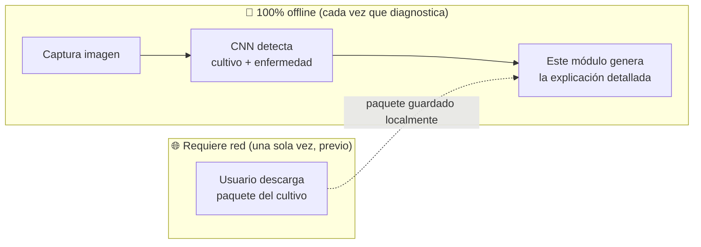
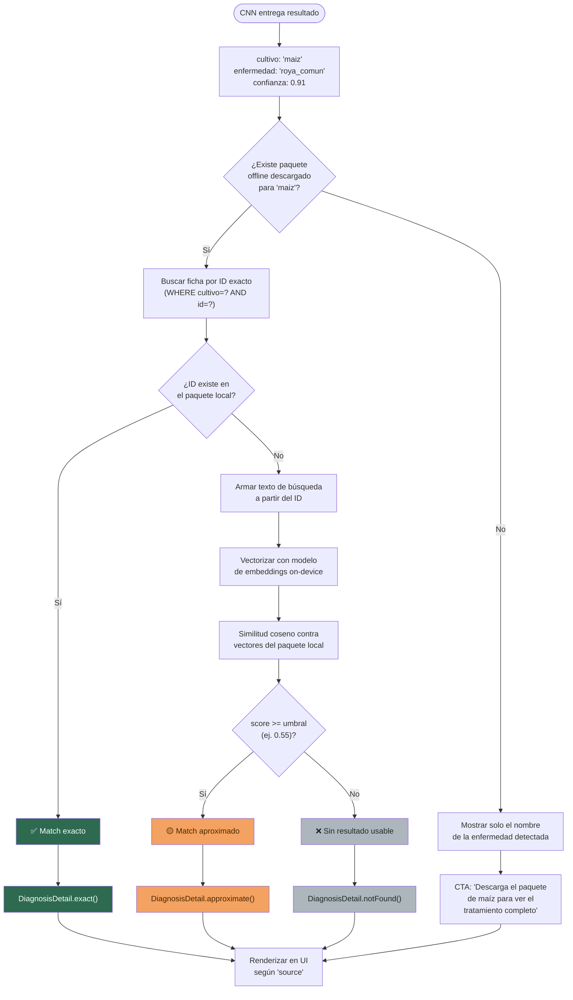
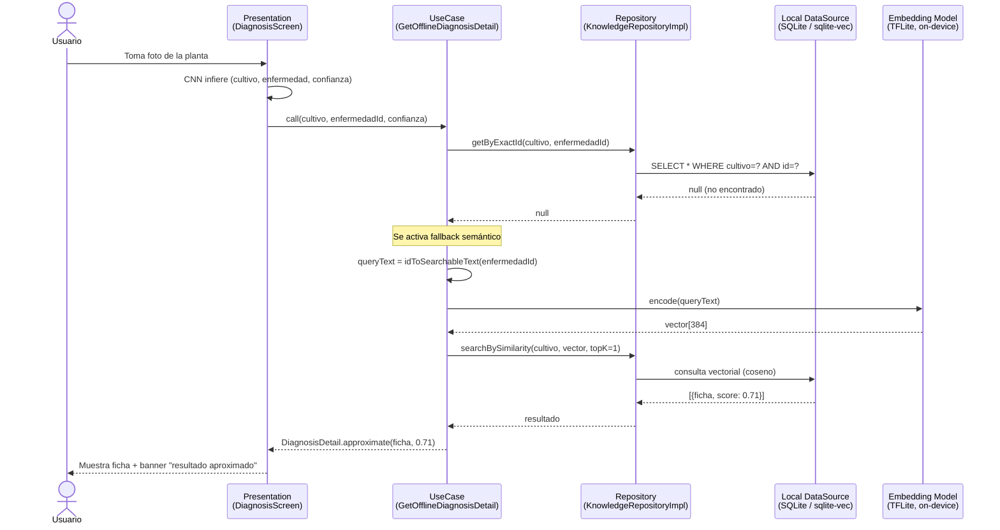
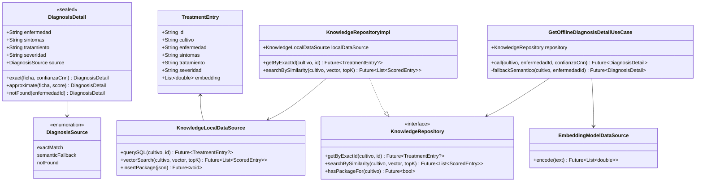
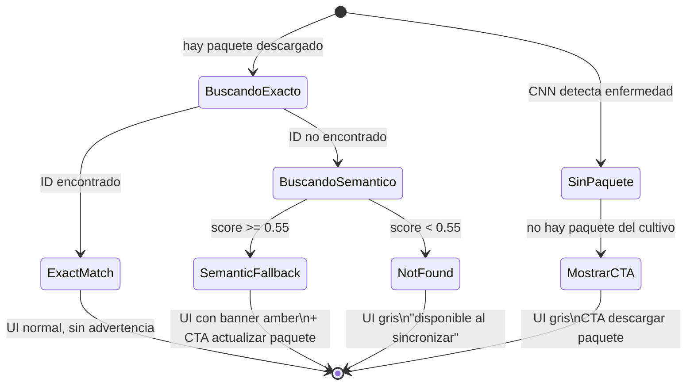
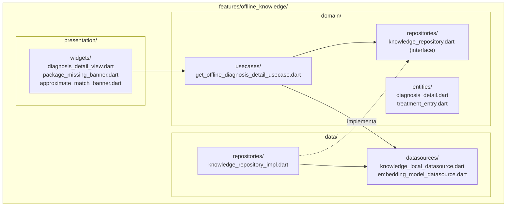

# AgroGraph — Flujo de Diagnóstico Offline (Embeddings)
### Documento técnico de arquitectura — Módulo de recomendación offline

> **Nota para implementación con Claude Code:** este documento es la especificación completa del módulo `features/offline_knowledge/`. La CNN (detección de cultivo + enfermedad) ya está implementada y NO forma parte de este alcance. Este documento cubre únicamente la generación de la explicación/recomendación detallada en modo offline, a partir del resultado que ya entrega la CNN.

---

## 0. Regla más importante del diseño

**El diagnóstico offline NO requiere ninguna llamada a API.** Todo el flujo descrito aquí ocurre 100% en el dispositivo, usando datos ya descargados previamente. La única vez que hay red involucrada es en un momento **anterior y separado**: cuando el usuario descarga el paquete de conocimiento de un cultivo (`GET /catalog/{cultivo}/offline-package`, fuera del alcance de este documento — se define después).

Una vez descargado el paquete, el ciclo completo de diagnóstico (imagen → enfermedad → explicación) funciona sin conexión, indefinidamente, hasta que el usuario decida actualizar el paquete.



---

## 1. Alcance

**Ya resuelto (fuera de este documento):**
- Captura de imagen y preprocesamiento.
- Inferencia CNN → `{cultivo, enfermedad, confianza}`.

**Lo que define este documento:**
- Cómo se transforma `{cultivo, enfermedad, confianza}` en una explicación de texto completa, offline.
- Cómo se estructura y consulta el índice local de conocimiento.
- Qué hace la app cuando no hay match confiable o no hay paquete descargado.

**Explícitamente fuera de alcance (se define en un documento posterior):**
- El endpoint `/catalog/{cultivo}/offline-package` y su contrato exacto.
- El flujo de descarga en sí (UI de progreso, manejo de errores de red al descargar).

---

## 2. Diagrama de flujo completo



**Punto clave de diseño:** la CNN entrega un *label discreto* (no texto libre), y ese label es exactamente el mismo `id` usado en el paquete de conocimiento. Por eso el camino principal es un **lookup directo por ID** (rama izquierda del diagrama, sin vectores). El embedding solo entra en juego como *fallback*, cuando el ID no está en el paquete descargado — típicamente porque el modelo CNN se reentrenó con nuevas clases y el usuario aún no actualizó su paquete local.

---

## 3. Diagrama de secuencia — caso completo (con fallback)



---

## 4. Diagrama de clases — modelo de dominio



---

## 5. Diagrama de estados — `DiagnosisSource` y su efecto en UI



---

## 6. Caso principal — Match exacto por ID (95%+ de los casos esperados)

Como el label de salida de la CNN es fijo (viene del set de clases con el que se entrenó el modelo) y el `id` de cada ficha del paquete JSON se genera con la misma nomenclatura, la búsqueda es una consulta directa, sin vectores:

```dart
// domain/usecases/get_offline_diagnosis_detail_usecase.dart
class GetOfflineDiagnosisDetailUseCase {
  final KnowledgeRepository repository;
  final EmbeddingModelDataSource embeddingModel;

  GetOfflineDiagnosisDetailUseCase(this.repository, this.embeddingModel);

  Future<DiagnosisDetail> call({
    required String cultivo,
    required String enfermedadId,   // viene directo de la CNN
    required double confianzaCnn,
  }) async {
    final tienePaquete = await repository.hasPackageFor(cultivo);
    if (!tienePaquete) {
      return DiagnosisDetail.packageMissing(cultivo);
    }

    final ficha = await repository.getByExactId(cultivo, enfermedadId);
    if (ficha != null) {
      return DiagnosisDetail.exact(ficha, confianzaCnn);
    }

    // No está en el paquete local → fallback semántico
    return _fallbackSemantico(cultivo, enfermedadId);
  }

  Future<DiagnosisDetail> _fallbackSemantico(String cultivo, String enfermedadId) async {
    final queryText = _idToSearchableText(enfermedadId, cultivo);
    final queryVector = await embeddingModel.encode(queryText);

    final resultados = await repository.searchBySimilarity(
      cultivo: cultivo,
      queryVector: queryVector,
      topK: 1,
    );

    if (resultados.isEmpty || resultados.first.score < 0.55) {
      return DiagnosisDetail.notFound(enfermedadId);
    }

    return DiagnosisDetail.approximate(resultados.first.ficha, resultados.first.score);
  }

  String _idToSearchableText(String id, String cultivo) {
    // ej. "roya_comun" + "maiz" → "roya común maíz"
    return '${id.replaceAll('_', ' ')} $cultivo';
  }
}
```

No requiere vectorizar nada en el camino principal — es una consulta SQL simple contra la tabla local donde se guardó el paquete descargado.

---

## 7. Estructura de respuesta — `DiagnosisDetail`

```dart
// domain/entities/diagnosis_detail.dart
sealed class DiagnosisDetail {
  final String enfermedad;
  final String sintomas;
  final String tratamiento;
  final String severidad;
  final DiagnosisSource source;

  const DiagnosisDetail({
    required this.enfermedad,
    required this.sintomas,
    required this.tratamiento,
    required this.severidad,
    required this.source,
  });

  factory DiagnosisDetail.exact(TreatmentEntry ficha, double confianzaCnn) => _Exact(ficha, confianzaCnn);
  factory DiagnosisDetail.approximate(TreatmentEntry ficha, double score) => _Approximate(ficha, score);
  factory DiagnosisDetail.notFound(String enfermedadId) => _NotFound(enfermedadId);
  factory DiagnosisDetail.packageMissing(String cultivo) => _PackageMissing(cultivo);
}

enum DiagnosisSource { exactMatch, semanticFallback, notFound, packageMissing }
```

### 7.1 Qué muestra la UI según el `source`

| `source` | Texto mostrado | Tono visual |
|---|---|---|
| `exactMatch` | Ficha completa, sin advertencia | Normal, igual que respuesta online |
| `semanticFallback` | Ficha + banner: *"Resultado aproximado — actualiza el paquete de [cultivo] para mayor precisión"* | Amber `#F4A261`, con botón "Actualizar ahora" |
| `notFound` | *"No se encontró información offline para esta enfermedad. Se mostrará al recuperar conexión."* | Gris `#ADB5BD`, mismo patrón del banner offline global |
| `packageMissing` | Solo nombre de enfermedad + *"Descarga el paquete de [cultivo] para ver el tratamiento completo"* | Gris `#ADB5BD` + CTA de descarga |

Reutiliza el mismo lenguaje visual ya definido para el banner offline global (ícono wifi-off) y el sistema de colores de estado de salud (`#E76F51` alerta, `#F4A261` seguimiento, `#2D6A4F` saludable).

---

## 8. Contrato de datos del paquete local (recordatorio — el endpoint se define después)

El paquete descargado es la única fuente de verdad offline. Estructura relevante para este flujo:

```json
{
  "cultivo": "maiz",
  "version": "2026.07.11",
  "embedding_model": "paraphrase-multilingual-MiniLM-L12-v2",
  "embedding_dim": 384,
  "fichas": [
    {
      "id": "roya_comun",
      "enfermedad": "Roya común",
      "sintomas": "Pústulas de color naranja-café en el envés de las hojas...",
      "tratamiento": "Aplicar fungicida triazol cada 10-14 días...",
      "severidad": "media",
      "embedding": [0.0123, -0.045]
    }
  ]
}
```

**Importante:** el campo `id` de cada ficha debe estar sincronizado 1:1 con las clases de salida del modelo CNN. Cualquier reentrenamiento que agregue/quite clases debe disparar una regeneración del paquete offline.

---

## 9. Estructura de carpetas (Clean Architecture)



| Capa | Responsabilidad en este flujo |
|---|---|
| `domain/usecases/` | `GetOfflineDiagnosisDetailUseCase` — orquesta match exacto → fallback semántico → not found |
| `domain/entities/` | `DiagnosisDetail`, `TreatmentEntry` |
| `data/datasources/` | `KnowledgeLocalDataSource` (consulta SQL exacta + búsqueda vectorial), `EmbeddingModelDataSource` (wrapper TFLite) |
| `data/repositories/` | `KnowledgeRepositoryImpl` — implementa `getByExactId` y `searchBySimilarity` |
| `presentation/` | Renderiza `DiagnosisDetail` según `source`, muestra banners de advertencia/CTA |

**Nota:** este feature **no toca `core/network/`** — no hay `ApiClient` involucrado en ningún punto de este flujo. Eso confirma la regla de la sección 0: cero dependencia de red para mostrar resultados offline.

---

## 10. Casos límite a contemplar

- **Paquete parcialmente corrupto o descarga interrumpida:** validar `fichas.length > 0` antes de indexar; si falla, tratar como `packageMissing`.
- **Cultivo detectado pero nunca descargado:** estado `packageMissing`, ya cubierto en el diagrama de estados.
- **Confianza baja de la CNN:** este documento asume que la CNN ya filtra esto antes de invocar el use case; si no es así, debe añadirse esa validación antes del paso 1.
- **Múltiples versiones de paquete en dispositivo:** al descargar una nueva versión, se reemplaza completamente el índice anterior de ese cultivo (no se mezclan versiones distintas del `embedding_model`).

---

## 11. Pendiente de definir (documentos posteriores)

- Contrato exacto del endpoint `GET /catalog/{cultivo}/offline-package`.
- Flujo de descarga (UI, manejo de error de red, progreso).
- Calibración real del umbral de similitud (`0.55` es un valor de arranque, no validado con datos).
- Política de expiración/recordatorio de actualización de paquetes.
- Tamaño máximo de almacenamiento local permitido por cultivos descargados simultáneamente.
