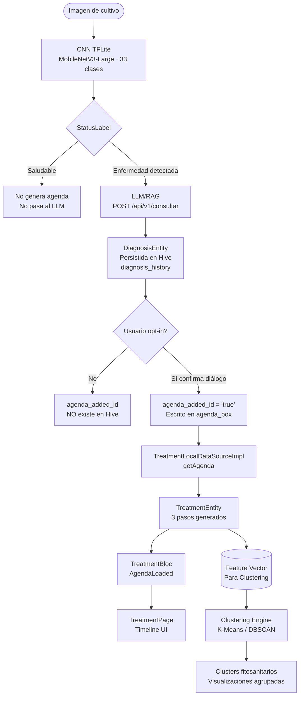
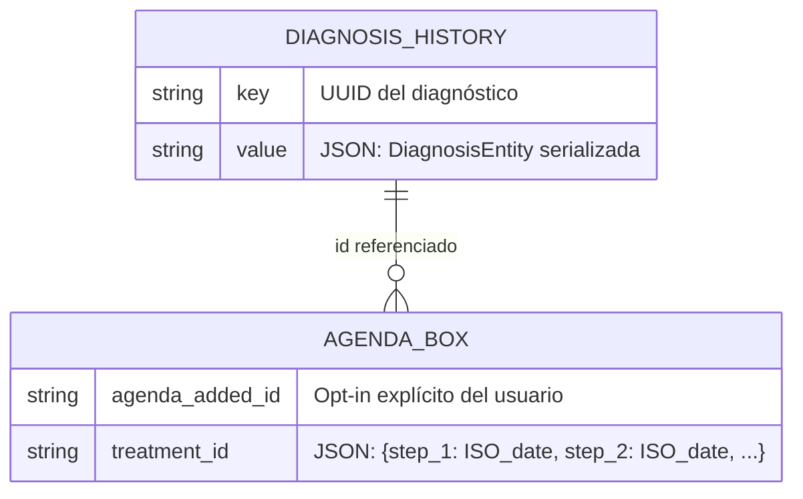
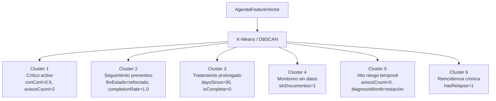
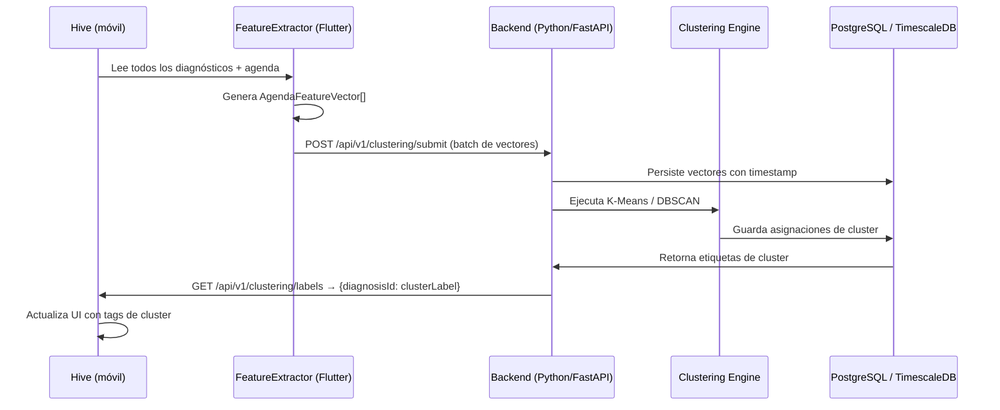
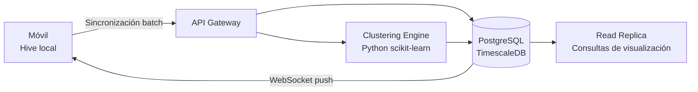

# AgroGraph-MAS — Arquitectura de Agenda Agronómica Inteligente y Sistema de Clustering

> **Propósito de este documento:** Especificación técnica de referencia para el módulo de Agenda dentro de AgroGraph-MAS y la hoja de ruta para construir el sistema de clustering fitosanitario. Todo el código referenciado está en producción en el proyecto Flutter ubicado en `lib/`.

---

## Tabla de Contenidos

1. [Introducción](#1-introducción)
2. [Arquitectura General](#2-arquitectura-general)
3. [Flujo de Generación de Agenda](#3-flujo-de-generación-de-agenda)
4. [Estructura de Datos de Agenda](#4-estructura-de-datos-de-agenda)
5. [Sistema de Tratamientos Continuos](#5-sistema-de-tratamientos-continuos)
6. [Preparación para Clustering](#6-preparación-para-clustering)
7. [Visualización de Agenda](#7-visualización-de-agenda)
8. [Escalabilidad](#8-escalabilidad)
9. [Recomendaciones Técnicas](#9-recomendaciones-técnicas)
10. [Conclusión](#10-conclusión)

---

## 1. Introducción

### 1.1 ¿Qué es la Agenda Agronómica Inteligente?

La **Agenda Agronómica Inteligente** de AgroGraph-MAS es el subsistema que transforma un diagnóstico fitosanitario puntual en un plan de acción temporal, estructurado y trazable. No es un calendario genérico: cada evento que aparece en la agenda es un derivado directo del resultado de la CNN y de la interpretación contextual del LLM/RAG.

Principio fundamental:

> **Sin diagnóstico CNN + respuesta LLM válidos → no existe entrada de agenda.**

El usuario tiene además control explícito: solo los diagnósticos para los que eligió "Agregar a la agenda" aparecen como tratamientos activos (opt-in confirmado por `agenda_added_{diagnosisId}` en Hive).

### 1.2 Importancia en el flujo fitosanitario

| Capa | Responsabilidad |
|------|----------------|
| CNN (MobileNetV3-Large TFLite) | Detecta qué enfermedad afecta al cultivo con confianza cuantificada |
| LLM/RAG (`52.1.110.21:8000`) | Interpreta el diagnóstico en contexto agronómico: tratamiento, prevención, fuentes |
| Diagnóstico (`DiagnosisEntity`) | Consolida CNN + LLM en un registro persistente en Hive |
| Agenda (`TreatmentEntity`) | Proyecta el diagnóstico en el tiempo como eventos accionables |
| Clustering (próxima iteración) | Agrupa patrones entre diagnósticos para inteligencia colectiva |

### 1.3 Relación CNN → LLM → Diagnóstico → Agenda

```
Imagen de cultivo
       │
       ▼
  CNN TFLite (local)
  MobileNetV3-Large · 33 clases · NCHW
       │ CnnResult {cropName, diseaseName, confidence, topK[]}
       ▼
  LLM/RAG (remoto)
  POST http://52.1.110.21:8000/api/v1/consultar
       │ LlmResponseEntity {diagnostico, tratamiento, prevencion,
       │                     confianzaAjustada, estado, sintomas, avisos}
       ▼
  DiagnosisEntity (Hive · diagnosis_history)
       │ id · diseaseName · cropName · confidence · statusLabel
       │ llmResponse (JSON embebido)
       ▼
  Opt-in usuario → agenda_added_{id} = 'true'
       ▼
  TreatmentEntity (derivado en tiempo de ejecución desde Hive)
       │ 3 pasos: día 0, día +7, día +14
       ▼
  Feature Vector por diagnóstico (para clustering)
```

---

## 2. Arquitectura General

### 2.1 Stack tecnológico

| Componente | Tecnología | Notas |
|-----------|------------|-------|
| App móvil | Flutter 3.x / Dart | iOS + Android |
| Estado | `flutter_bloc` (BLoC pattern) | `TreatmentBloc`, `DiagnosisBloc`, `LlmDiagnosisCubit` |
| Persistencia local | Hive (`Box<String>`) | JSON codificado manualmente |
| CNN | TFLite MobileNetV3-Large | 33 clases crop×disease, layout NCHW |
| LLM/RAG | Microservicio HTTP REST | `http://52.1.110.21:8000/api/v1/consultar` |
| Arquitectura | Clean Architecture | Presentation → Domain → Data |
| Inyección de dependencias | GetIt (`sl`) | Lazy singletons |
| Either | `dartz` | `Either<Failure, T>` en repositorios |

### 2.2 Capas del módulo de Agenda

```
┌─────────────────────────────────────────────────────────────────┐
│  PRESENTATION                                                   │
│  TreatmentPage → BlocBuilder<TreatmentBloc>                     │
│  _TreatmentCard · _TimelineStep · _EmptyView · _ErrorView       │
├─────────────────────────────────────────────────────────────────┤
│  BLOC                                                           │
│  TreatmentBloc                                                  │
│    Events: TreatmentAgendaRequested · TreatmentStepCompleted    │
│    States: Initial · Loading · AgendaLoaded · StepMarked · Fail │
├─────────────────────────────────────────────────────────────────┤
│  DOMAIN                                                         │
│  TreatmentEntity · TreatmentStepEntity                         │
│  GetTreatmentAgendaUseCase · MarkStepCompleteUseCase            │
│  TreatmentRepository (abstract)                                 │
├─────────────────────────────────────────────────────────────────┤
│  DATA                                                           │
│  TreatmentRepositoryImpl                                        │
│  TreatmentLocalDataSourceImpl                                   │
│    ├─ Box<String> diagnosisBox  ('diagnosis_history')           │
│    └─ Box<String> agendaBox     ('agenda_box')                  │
│  TreatmentModel · TreatmentStepModel                            │
└─────────────────────────────────────────────────────────────────┘
```

### 2.3 Diagrama completo de flujo de datos



### 2.4 Interacción entre Hive boxes



---

## 3. Flujo de Generación de Agenda

### 3.1 Paso a paso detallado

#### Paso 1 — CNN detecta condición

```dart
// lib/features/diagnosis/data/services/cnn_engine/cnn_result.dart
class CnnResult {
  final String cropName;      // Ej: "Tomate"
  final String diseaseName;   // Ej: "Tizón tardío"
  final double confidence;    // Ej: 0.923
  final List<TopKPrediction> topK;  // Top-5 predicciones alternativas
}
```

El modelo MobileNetV3-Large produce un `CnnResult` con confianza cuantificada. Si `statusLabel == 'Saludable'`, el flujo termina aquí — no se genera agenda.

#### Paso 2 — LLM interpreta contexto agronómico

```dart
// lib/features/diagnosis/domain/entities/llm_response_entity.dart
class LlmResponseEntity {
  final String diagnostico;         // Análisis clínico textual
  final String tratamiento;         // Protocolo de tratamiento detallado
  final String prevencion;          // Medidas preventivas futuras
  final List<String> fuentes;       // Referencias agronómicas consultadas
  final double confianzaAjustada;   // Confianza combinada CNN+LLM [0.0-1.0]
  final String estado;              // "reforzado" | "posible_contradiccion" | "sin_senal_textual"
  final String explicacion;         // Razonamiento del LLM
  final List<String> sintomas;      // Síntomas identificados
  final List<String> avisos;        // Alertas críticas
  final bool sinDocumentos;         // True si el RAG no encontró documentos relevantes
}
```

La respuesta LLM es la fuente principal de contenido para la agenda. El campo `confianzaAjustada` determina la prioridad del tratamiento; `estado` indica si el LLM reforzó o contradijo el diagnóstico CNN.

#### Paso 3 — DiagnosisEntity consolidada y persistida

```json
{
  "id": "uuid-v4",
  "diseaseName": "Tizón tardío",
  "cropName": "Tomate",
  "confidence": 0.923,
  "statusLabel": "Seguimiento",
  "diagnosedAt": "2026-07-01T10:30:00.000Z",
  "imagePath": "/data/user/0/.../cache/img.jpg",
  "llmResponse": {
    "diagnostico": "Presencia confirmada de Phytophthora infestans...",
    "tratamiento": "Aplicar fungicida de contacto (mancozeb 80%)...",
    "prevencion": "Rotación de cultivos cada 2 temporadas...",
    "fuentes": ["FAO-2023", "CIMMYT-guide-v4"],
    "confianzaAjustada": 0.891,
    "estado": "reforzado",
    "explicacion": "El patrón lesional coincide con la base documental...",
    "sintomas": ["lesiones necróticas", "halo amarillo", "micelio blanco"],
    "avisos": ["Riesgo de propagación alta en condiciones húmedas"],
    "sinDocumentos": false
  }
}
```

#### Paso 4 — Opt-in explícito del usuario

El sistema **no registra automáticamente** en la agenda. El usuario debe confirmar en `DiagnosisResultPage`:

```dart
// lib/features/diagnosis/presentation/pages/diagnosis_result_page.dart
void _addToAgenda() async {
  final confirmed = await showDialog<bool>(...); // AlertDialog de confirmación
  if (confirmed == true) {
    await _agendaBox.put('agenda_added_${widget.diagnosis.id}', 'true');
    setState(() => _isAddedToAgenda = true);
    context.read<TreatmentBloc>().add(const TreatmentAgendaRequested());
  }
}
```

#### Paso 5 — Generación automática de 3 pasos de tratamiento

```dart
// lib/features/treatment/data/datasources/treatment_local_datasource.dart
List<TreatmentStepModel> _buildSteps(
  DateTime diagnosedAt,
  LlmResponseEntity llm,
  Map<String, dynamic> completions,
) {
  final step1Date = diagnosedAt;                          // Día 0
  final step2Date = diagnosedAt.add(Duration(days: 7));  // Día +7
  final step3Date = diagnosedAt.add(Duration(days: 14)); // Día +14
  // ...
}
```

| Paso | Título | Fecha | Contenido |
|------|--------|-------|-----------|
| step_1 | Primera aplicación | Día diagnóstico (D+0) | `llm.tratamiento` (primeros 280 chars) |
| step_2 | Segunda aplicación | D+7 | Refuerzo genérico del tratamiento |
| step_3 | Revisión y prevención | D+14 | `llm.prevencion` (primeros 220 chars) |

#### Paso 6 — Clasificación de estados de pasos

```
Estados posibles por paso:
  completado  → El usuario marcó el paso como terminado (fecha guardada en Hive)
  programado  → Primer paso no completado (acción requerida ahora)
  pendiente   → Pasos posteriores al programado (aún no activos)

Algoritmo de asignación:
  for each step in [step_1, step_2, step_3]:
    if completions.containsKey(stepId) → 'completado'
    else → 'pendiente'
  
  first non-completado → override a 'programado'
```

---

## 4. Estructura de Datos de Agenda

### 4.1 Entidad de dominio — `TreatmentEntity`

```dart
// lib/features/treatment/domain/entities/treatment_entity.dart
class TreatmentEntity {
  final String id;               // UUID del diagnóstico origen
  final String diseaseName;      // Nombre de la enfermedad detectada
  final String cropName;         // Cultivo afectado
  final String llmDiagnostico;  // Resumen diagnóstico del LLM
  final String llmTratamiento;  // Protocolo de tratamiento del LLM
  final String llmPrevencion;   // Medidas preventivas del LLM
  final int totalSteps;          // Siempre 3 en implementación actual
  final int completedSteps;      // Pasos completados por el usuario
  final bool remindersActive;    // True por defecto
  final List<TreatmentStepEntity> steps;
  final DateTime createdAt;      // Fecha del diagnóstico original

  // Getters calculados
  double get progress => completedSteps / totalSteps;       // 0.0 - 1.0
  int get progressPercent => (progress * 100).toInt();      // 0 - 100
}
```

### 4.2 Entidad de paso — `TreatmentStepEntity`

```dart
class TreatmentStepEntity {
  final String id;              // "step_1" | "step_2" | "step_3"
  final int stepNumber;         // 1 | 2 | 3
  final String title;           // Nombre humano del paso
  final String description;     // Contenido LLM truncado
  final String status;          // "completado" | "programado" | "pendiente"
  final DateTime scheduledDate; // Fecha objetivo del paso
  final DateTime? completedDate; // Fecha real de completado (nullable)

  bool get isCompleted => status == 'completado';
  bool get isScheduled => status == 'programado';
}
```

### 4.3 Esquema de persistencia en Hive

```
agenda_box
├── agenda_added_{uuid}       → 'true'
│                                (Opt-in del usuario por diagnóstico)
│
└── treatment_{uuid}          → '{"step_1":"2026-07-01T10:30:00.000Z",
                                   "step_2":"2026-07-08T14:20:00.000Z"}'
                                 (Fechas de completado por paso; step_3 ausente si pendiente)

diagnosis_history
└── {uuid}                    → JSON completo DiagnosisEntity + llmResponse embebido
```

### 4.4 JSON canónico de un tratamiento completo

```json
{
  "id": "a3f7c812-9d4e-4b2a-8f1c-2e5d0b9a7c3f",
  "disease_name": "Tizón tardío",
  "crop_name": "Tomate",
  "llm_diagnostico": "Presencia confirmada de Phytophthora infestans con patrón lesional típico en hojas basales.",
  "llm_tratamiento": "Aplicar fungicida de contacto (mancozeb 80%) en dosis de 2.5 g/L cada 7 días durante 3 semanas...",
  "llm_prevencion": "Implementar rotación de cultivos, mejorar drenaje del suelo y evitar riego por aspersión...",
  "total_steps": 3,
  "completed_steps": 1,
  "reminders_active": true,
  "created_at": "2026-07-01T10:30:00.000Z",
  "steps": [
    {
      "id": "step_1",
      "step_number": 1,
      "title": "Primera aplicación",
      "description": "Aplicar fungicida de contacto (mancozeb 80%)...",
      "status": "completado",
      "scheduled_date": "2026-07-01T10:30:00.000Z",
      "completed_date": "2026-07-01T16:45:00.000Z"
    },
    {
      "id": "step_2",
      "step_number": 2,
      "title": "Segunda aplicación",
      "description": "Repetir el tratamiento para reforzar el control de la enfermedad.",
      "status": "programado",
      "scheduled_date": "2026-07-08T10:30:00.000Z",
      "completed_date": null
    },
    {
      "id": "step_3",
      "step_number": 3,
      "title": "Revisión y prevención",
      "description": "Implementar rotación de cultivos, mejorar drenaje del suelo...",
      "status": "pendiente",
      "scheduled_date": "2026-07-15T10:30:00.000Z",
      "completed_date": null
    }
  ]
}
```

### 4.5 Schema TypeScript para integración backend

```typescript
interface TreatmentStepSchema {
  id: "step_1" | "step_2" | "step_3";
  stepNumber: 1 | 2 | 3;
  title: string;
  description: string;
  status: "completado" | "programado" | "pendiente";
  scheduledDate: string;       // ISO 8601
  completedDate: string | null; // ISO 8601 | null
}

interface TreatmentSchema {
  id: string;                  // UUID del diagnóstico origen
  diseaseName: string;
  cropName: string;
  llmDiagnostico: string;
  llmTratamiento: string;
  llmPrevencion: string;
  totalSteps: number;          // 3 (actualmente fijo)
  completedSteps: number;      // 0-3
  progress: number;            // 0.0 - 1.0
  progressPercent: number;     // 0 - 100
  remindersActive: boolean;
  createdAt: string;           // ISO 8601
  steps: TreatmentStepSchema[];
}

// Hive keys
type AgendaBoxKey =
  | `agenda_added_${string}`   // opt-in: valor 'true'
  | `treatment_${string}`;     // completions: JSON {step_id: ISO_date}
```

---

## 5. Sistema de Tratamientos Continuos

### 5.1 Modelo actual: 3 pasos fijos (D+0, D+7, D+14)

La implementación actual genera exactamente 3 pasos por diagnóstico con offsets fijos de 7 días. Esto cubre enfermedades con ciclo de tratamiento de 2 semanas, que es el caso más común en el dataset de 50 clases.

```
Día  0: step_1 — Primera aplicación    [llm.tratamiento]
Día  7: step_2 — Segunda aplicación    [Refuerzo genérico]
Día 14: step_3 — Revisión y prevención [llm.prevencion]
```

### 5.2 Extensión para tratamientos indefinidos (diseño futuro)

Para enfermedades crónicas o cultivos de ciclo largo, el sistema debe soportar generación dinámica de pasos:

```dart
// Propuesta de extensión en TreatmentLocalDataSourceImpl
enum TreatmentProtocol {
  acute,      // 3 pasos · 0-7-14 días (actual)
  subacute,   // 5 pasos · 0-7-14-21-28 días
  chronic,    // Indefinido · generación dinámica mensual
  monitoring, // Solo revisiones · 0-30-60-90 días
}

// Determinado por confianzaAjustada del LLM + clase de enfermedad del CNN
TreatmentProtocol _resolveProtocol(LlmResponseEntity llm, double cnnConfidence) {
  if (llm.sinDocumentos) return TreatmentProtocol.monitoring;
  if (llm.confianzaAjustada > 0.85) return TreatmentProtocol.acute;
  if (llm.confianzaAjustada > 0.65) return TreatmentProtocol.subacute;
  return TreatmentProtocol.chronic;
}
```

### 5.3 Tabla de protocolos por severidad

| Severidad | `confianzaAjustada` | Protocolo | Pasos | Duración |
|-----------|---------------------|-----------|-------|----------|
| Crítica | ≥ 0.90 | acute | 3 (D+0, D+7, D+14) | 2 semanas |
| Alta | 0.75 – 0.89 | subacute | 5 (D+0 a D+28) | 4 semanas |
| Media | 0.60 – 0.74 | chronic | ∞ generación mensual | Indefinido |
| Monitoreo | `sinDocumentos=true` | monitoring | 4 (D+0 a D+90) | 3 meses |

### 5.4 Manejo de recaídas

Una recaída ocurre cuando:
- El mismo cultivo genera un nuevo diagnóstico de la misma enfermedad < 30 días después de completar el tratamiento anterior.

```dart
// Detección de recaída (lógica propuesta)
bool _isRelapse(DiagnosisEntity current, List<DiagnosisEntity> history) {
  return history.any((prev) =>
    prev.diseaseName == current.diseaseName &&
    prev.cropName == current.cropName &&
    current.diagnosedAt.difference(prev.diagnosedAt).inDays < 30 &&
    prev.id != current.id
  );
}
```

Cuando se detecta una recaída, se genera un tratamiento de protocolo `chronic` independientemente de la confianza, y se añade el aviso `"Recaída detectada"` al vector de features para clustering.

---

## 6. Preparación para Clustering

Esta es la sección central para la próxima iteración del sistema.

### 6.1 Concepto de Feature Vector fitosanitario

Cada diagnóstico+tratamiento genera un vector de características numéricas y categóricas que alimentará el motor de clustering. Este vector se denomina **AgendaFeatureVector**.

```typescript
interface AgendaFeatureVector {
  // === IDENTIDAD ===
  diagnosisId: string;
  cropName: string;           // Categórico — one-hot encoding
  diseaseName: string;        // Categórico — one-hot encoding (50 clases)

  // === FEATURES DEL CNN ===
  cnnConfidence: number;      // [0.0 – 1.0] — continuo
  topKEntropy: number;        // Entropía del top-5 (diversidad de predicciones)
  // H = -Σ p_i * log(p_i) donde p_i son las confianzas del top-K

  // === FEATURES DEL LLM ===
  llmConfianzaAjustada: number;  // [0.0 – 1.0] — continuo
  llmEstado: number;             // 0=sin_senal | 0.5=contradiccion | 1=reforzado
  llmSinDocumentos: number;      // 0 | 1 (binario)
  sintomasCount: number;         // Cantidad de síntomas listados
  avisosCount: number;           // Cantidad de alertas (proxy de severidad)
  diagnosticoLength: number;     // Longitud del diagnóstico (proxy de complejidad)

  // === FEATURES DE AGENDA ===
  daysToFirstStep: number;       // Siempre 0 en impl. actual
  totalSteps: number;            // 3 en impl. actual
  completionRate: number;        // [0.0 – 1.0] completedSteps/totalSteps
  daysSinceCreation: number;     // Días desde el diagnóstico
  isComplete: number;            // 0 | 1
  hasRelapse: number;            // 0 | 1 — detectado por lógica de recaída

  // === TEMPORALIDAD ===
  diagnosisMonth: number;        // 1-12 (estacionalidad)
  diagnosisDayOfWeek: number;    // 0-6

  // === TAGS PARA VISUALIZACIÓN ===
  priorityTag: "critica" | "alta" | "media" | "monitoreo";
  clusterLabel?: string;         // Asignado después del clustering
}
```

### 6.2 Cómo extraer features desde el código actual

```dart
// Propuesta: lib/features/clustering/data/feature_extractor.dart

AgendaFeatureVector extractFeatures(
  DiagnosisEntity diagnosis,
  TreatmentEntity treatment,
) {
  final llm = diagnosis.llmResponse!;
  final topKConfs = diagnosis.topK.map((p) => p.confidence).toList();

  // Entropía del top-K del CNN
  final entropy = topKConfs.fold<double>(0.0, (sum, p) {
    return p > 0 ? sum - p * (p > 0 ? math.log(p) / math.ln2 : 0) : sum;
  });

  // Mapeo de estado LLM a valor numérico
  final estadoNum = switch (llm.estado) {
    'reforzado' => 1.0,
    'posible_contradiccion' => 0.5,
    _ => 0.0,  // 'sin_senal_textual'
  };

  return AgendaFeatureVector(
    diagnosisId: diagnosis.id,
    cropName: diagnosis.cropName,
    diseaseName: diagnosis.diseaseName,
    cnnConfidence: diagnosis.confidence,
    topKEntropy: entropy,
    llmConfianzaAjustada: llm.confianzaAjustada,
    llmEstado: estadoNum,
    llmSinDocumentos: llm.sinDocumentos ? 1.0 : 0.0,
    sintomasCount: llm.sintomas.length.toDouble(),
    avisosCount: llm.avisos.length.toDouble(),
    diagnosticoLength: llm.diagnostico.length.toDouble(),
    completionRate: treatment.progress,
    daysSinceCreation: DateTime.now().difference(treatment.createdAt).inDays.toDouble(),
    isComplete: treatment.progressPercent == 100 ? 1.0 : 0.0,
    diagnosisMonth: treatment.createdAt.month.toDouble(),
    diagnosisDayOfWeek: treatment.createdAt.weekday.toDouble(),
  );
}
```

### 6.3 Normalización de features

Antes de alimentar al algoritmo de clustering, todos los features continuos deben normalizarse al rango [0, 1] usando min-max scaling:

```
x_norm = (x - x_min) / (x_max - x_min)
```

| Feature | Rango natural | Normalización |
|---------|--------------|---------------|
| `cnnConfidence` | [0.0, 1.0] | Ya normalizado |
| `llmConfianzaAjustada` | [0.0, 1.0] | Ya normalizado |
| `topKEntropy` | [0.0, ~2.3] | `/math.log(5)/math.ln2` (entropía máx top-5) |
| `sintomasCount` | [0, ∞] | Clip en 10, `/10` |
| `avisosCount` | [0, ∞] | Clip en 5, `/5` |
| `diagnosticoLength` | [0, ∞] | Clip en 1000, `/1000` |
| `daysSinceCreation` | [0, ∞] | Clip en 90, `/90` |
| `completionRate` | [0.0, 1.0] | Ya normalizado |
| `diagnosisMonth` | [1, 12] | `(x-1)/11` |

Variables categóricas (`cropName`, `diseaseName`) → One-hot encoding.

### 6.4 Clusters fitosanitarios propuestos



| Cluster | Nombre | Features dominantes | Acción recomendada |
|---------|--------|--------------------|--------------------|
| 1 | Crítico activo | `cnnConf > 0.90`, `avisosCount > 2`, `completionRate < 0.33` | Notificación prioritaria; escalar a agrónomo |
| 2 | Seguimiento preventivo | `llmEstado = reforzado`, `completionRate = 1.0` | Mantener en agenda de revisión mensual |
| 3 | Tratamiento prolongado | `daysSince > 30`, `isComplete = 0` | Recordatorio de abandono; replanificar |
| 4 | Monitoreo sin datos | `sinDocumentos = 1`, `topKEntropy > 1.5` | Solicitar más imágenes; CNN incierto |
| 5 | Alto riesgo estacional | `avisosCount > 0`, `diagnosisMonth ∈ {11,12,1}` | Alerta estacional colectiva |
| 6 | Reincidencia crónica | `hasRelapse = 1` | Protocolo crónico; análisis de suelo |

### 6.5 Algoritmos de clustering recomendados

```
Fase 1 — Exploración (dataset < 500 diagnósticos):
  K-Means con k=6
  Inicialización: K-Means++ para convergencia estable
  Métrica: Euclidiana sobre features normalizados

Fase 2 — Producción (dataset > 500 diagnósticos):
  DBSCAN para detectar outliers (diagnósticos anómalos)
  epsilon: 0.35  (ajustar por validación silhouette)
  min_samples: 5

Fase 3 — Incremental (stream de diagnósticos en tiempo real):
  Mini-Batch K-Means
  Actualizar centroides con cada nuevo batch de 50 diagnósticos
```

### 6.6 Pipeline de clustering completo



---

## 7. Visualización de Agenda

### 7.1 Timeline clínico actual (implementado)

La UI actual en `TreatmentPage` implementa un **timeline lineal vertical** con tres niveles visuales por estado:

```
Estado COMPLETADO:
  ● Verde sólido + ícono check_rounded
  → Chip "completado" (verde)
  → Título tachado + color atenuado

Estado PROGRAMADO (acción requerida ahora):
  ◉ Círculo naranja con borde + ícono schedule_rounded
  → Chip "pendiente" (naranja)
  → Botón "Marcar completado" (verde, 34px height)

Estado PENDIENTE (futuro):
  ○ Círculo gris numerado
  → Chip "programado" (gris)
  → Sin botón de acción
```

Conector vertical entre pasos:
- Verde semitransparente si el paso anterior está completado
- Gris si el paso anterior está incompleto

### 7.2 Indicadores visuales de severidad (extensión para clustering)

Cuando el sistema de clustering esté activo, la `_TreatmentCard` debe extenderse para mostrar indicadores de cluster:

```dart
// Paleta de colores por cluster
static const Map<String, Color> clusterColors = {
  'critico_activo':          Color(0xFFD32F2F), // Rojo
  'seguimiento_preventivo':  Color(0xFF388E3C), // Verde
  'tratamiento_prolongado':  Color(0xFFF57C00), // Naranja oscuro
  'monitoreo_sin_datos':     Color(0xFF757575), // Gris
  'alto_riesgo_estacional':  Color(0xFFE65100), // Naranja
  'reincidencia_cronica':    Color(0xFF6A1B9A), // Púrpura
};
```

```
┌──────────────────────────────────────────────┐
│ 🔴 CRÍTICO ACTIVO          [ACTIVO]          │
│ Tizón tardío · Tomate · 1 Jul 2026           │
│                                              │
│ "Presencia confirmada de Phytophthora..."    │
│                                              │
│ Paso 1 de 3    ████░░░░░░  33% completado   │
│ ─────────────────────────────────────────── │
│ ✓ Primera aplicación         [completado]   │
│   1 Jul ── Aplicar mancozeb 80%...          │
│                                             │
│ ◉ Segunda aplicación         [pendiente]    │
│   8 Jul ── Repetir tratamiento...           │
│   [  Marcar completado  ]                   │
│                                             │
│ ○  3  Revisión y prevención  [programado]   │
│   15 Jul ── Rotación de cultivos...         │
└──────────────────────────────────────────────┘
```

### 7.3 Agrupación inteligente en la lista

Con clustering activo, los tratamientos deben ordenarse por prioridad de cluster, no solo por fecha:

```dart
// Orden de visualización recomendado
int _clusterPriority(TreatmentEntity t) => switch (t.clusterLabel) {
  'critico_activo'         => 0,
  'alto_riesgo_estacional' => 1,
  'reincidencia_cronica'   => 2,
  'tratamiento_prolongado' => 3,
  'monitoreo_sin_datos'    => 4,
  'seguimiento_preventivo' => 5,
  _                        => 6,
};

treatments.sort((a, b) =>
  _clusterPriority(a).compareTo(_clusterPriority(b))
);
```

### 7.4 Dashboard de clustering (vista agregada)

```
┌─────────────────────────────────────────────────┐
│  RESUMEN FITOSANITARIO                          │
│  ─────────────────────────────────────────────  │
│  🔴 Críticos activos        ██████░░  3 casos   │
│  🟠 Tratamiento prolongado  ████░░░░  2 casos   │
│  🟡 Riesgo estacional       ██░░░░░░  1 caso    │
│  🟢 En seguimiento          ████████  4 casos   │
│  ⚫ Sin datos CNN           █░░░░░░░  1 caso    │
│                                                 │
│  Enfermedad más frecuente: Tizón tardío (4x)   │
│  Cultivo más afectado: Tomate (6x)              │
└─────────────────────────────────────────────────┘
```

---

## 8. Escalabilidad

### 8.1 Limitaciones del modelo Hive actual

| Limitación | Impacto | Solución propuesta |
|-----------|---------|-------------------|
| `Box<String>` sin índices | Lectura secuencial O(n) | Migrar a `Box<DiagnosisHiveObject>` con `TypeAdapter` |
| JSON manual | Riesgo de inconsistencia | Generar codegen con `hive_generator` |
| Sin paginación | Lentitud con >200 diagnósticos | Lazy loading por rangos de fecha |
| Sin sincronización offline | Datos solo en dispositivo | Queue de sincronización con backend |

### 8.2 Arquitectura de sincronización móvil ↔ backend



### 8.3 Indexación recomendada para backend

```sql
-- Tabla de diagnósticos
CREATE TABLE diagnoses (
  id            UUID PRIMARY KEY,
  user_id       UUID NOT NULL,
  crop_name     VARCHAR(50) NOT NULL,
  disease_name  VARCHAR(100) NOT NULL,
  confidence    FLOAT NOT NULL,
  status_label  VARCHAR(20) NOT NULL,
  diagnosed_at  TIMESTAMPTZ NOT NULL,
  created_at    TIMESTAMPTZ DEFAULT NOW()
);

CREATE INDEX idx_diagnoses_user_date  ON diagnoses (user_id, diagnosed_at DESC);
CREATE INDEX idx_diagnoses_disease    ON diagnoses (disease_name);
CREATE INDEX idx_diagnoses_crop       ON diagnoses (crop_name);

-- Tabla de feature vectors para clustering
CREATE TABLE agenda_feature_vectors (
  diagnosis_id          UUID REFERENCES diagnoses(id),
  cnn_confidence        FLOAT,
  top_k_entropy         FLOAT,
  llm_confianza         FLOAT,
  llm_estado            FLOAT,
  llm_sin_documentos    BOOLEAN,
  sintomas_count        INT,
  avisos_count          INT,
  completion_rate       FLOAT,
  has_relapse           BOOLEAN,
  cluster_label         VARCHAR(50),
  clustered_at          TIMESTAMPTZ,
  PRIMARY KEY (diagnosis_id)
);

-- TimescaleDB hypertable para series temporales de pasos
SELECT create_hypertable('treatment_steps_timeline', 'scheduled_date');
```

### 8.4 Estrategia de persistencia en tiempo real

Para notificaciones de próximos pasos programados, se recomienda:

```
Opción A (local, implementación inmediata):
  flutter_local_notifications + workmanager
  Job diario que revisa treatment_{id} en Hive y dispara notificación
  si hay un step con scheduledDate = hoy

Opción B (server-side, escalable):
  FCM (Firebase Cloud Messaging)
  Backend calcula próximos pasos y envía push 24h antes
  Permite personalización por cluster (cluster crítico → push urgente)
```

---

## 9. Recomendaciones Técnicas

### 9.1 Mejoras inmediatas al módulo de Agenda (sin romper nada)

| # | Mejora | Archivo | Impacto |
|---|--------|---------|---------|
| 1 | Agregar campo `severityScore` a `TreatmentEntity` calculado de `llmConfianzaAjustada` | `treatment_entity.dart` | Habilita ordenamiento por severidad |
| 2 | Almacenar `statusLabel` del diagnóstico en la agenda | `treatment_local_datasource.dart` | Distingue "Seguimiento" de "Enfermedad grave" en UI |
| 3 | Agregar `hasRelapse` flag a `TreatmentEntity` | `treatment_entity.dart` | Feature clave para clustering |
| 4 | Serializar `topK` en `diagnosis_history` | Datasource de diagnóstico | Habilita cálculo de entropía sin nueva inferencia |
| 5 | Extender a 5 pasos para `confianzaAjustada < 0.75` | `treatment_local_datasource.dart` | Protocolos más completos |

### 9.2 Arquitectura recomendada para el motor de clustering

```
Fase MVP (datos locales en dispositivo, sin backend):
  - Dart puro con K-Means manual
  - Vectores guardados en Hive separado: 'clustering_box'
  - Clustering ejecutado en isolate (compute())
  - Etiquetas actualizadas cada vez que se abre la agenda

Fase producción:
  - FastAPI + scikit-learn en servidor
  - Envío de vectores por batch (WiFi solamente)
  - Modelos almacenados en formato joblib con versionado
  - Resultados cacheados en Redis TTL 6h
```

### 9.3 Estrategia de embeddings LLM para clustering semántico

```python
# Backend Python — clustering semántico opcional
from sentence_transformers import SentenceTransformer

model = SentenceTransformer('paraphrase-multilingual-mpnet-base-v2')

def get_embeddings(diagnosticos: list[str]) -> np.ndarray:
    """
    Genera embeddings de 768 dimensiones para los textos de diagnóstico.
    Permite clustering semántico más allá de features numéricos.
    """
    return model.encode(diagnosticos, normalize_embeddings=True)

# Reducción de dimensionalidad antes del clustering
from sklearn.decomposition import PCA
pca = PCA(n_components=32)  # 768 → 32 dimensiones
embeddings_reduced = pca.fit_transform(embeddings)
```

### 9.4 Tecnologías recomendadas por capa

| Capa | Tecnología | Justificación |
|------|-----------|---------------|
| App Flutter | `hive` + `flutter_bloc` | Ya en uso; estable |
| Feature extraction | Dart isolates | Sin dependencias externas |
| Backend clustering | FastAPI + scikit-learn | Rápido de implementar |
| Almacenamiento vectores | pgvector (PostgreSQL) | Búsqueda por similitud nativa |
| Series temporales | TimescaleDB | Ideal para timeline de pasos |
| Push notifications | FCM | Integración Flutter nativa |
| Visualización admin | Apache Superset | Dashboards sobre PostgreSQL |

---

## 10. Conclusión

### 10.1 Por qué la Agenda es la clave del sistema

La Agenda Agronómica Inteligente de AgroGraph-MAS no es un módulo auxiliar: es el **punto de convergencia** donde el conocimiento técnico (CNN + LLM) se transforma en acción temporal para el agricultor. Sin la agenda:

- El diagnóstico CNN queda como un dato puntual sin seguimiento.
- El protocolo LLM nunca se ejecuta.
- No hay historial estructurado para aprender de los patrones de enfermedad.

### 10.2 Por qué el clustering depende de la calidad de la agenda

El clustering fitosanitario es solo tan bueno como los datos que consume. Si la agenda almacena datos genéricos (sin `confianzaAjustada`, sin `estado` del LLM, sin temporalidad exacta), los clusters serán ruido estadístico.

La estructura actual del sistema ya persiste todos los campos necesarios:
- `LlmResponseEntity.confianzaAjustada` → feature de confianza
- `LlmResponseEntity.estado` → feature de coherencia CNN-LLM
- `LlmResponseEntity.avisos` → proxy de severidad
- `DiagnosisEntity.confidence` → feature CNN
- `DiagnosisEntity.topK` → feature de entropía (a serializar)
- `TreatmentEntity.completionRate` → feature de adherencia

### 10.3 Riesgos de mantener datos genéricos

| Riesgo | Consecuencia |
|--------|-------------|
| Descripción de pasos sin contenido LLM | Clusters basados en texto genérico — sin valor |
| Agregar todos los diagnósticos sin opt-in | Ruido de casos "Saludable" contamina clusters |
| No serializar `topK` | Imposible calcular entropía del CNN en clustering |
| Sin campo `hasRelapse` | Cluster de reincidencia crónica indetectable |
| Sin `statusLabel` persistido en agenda | Imposible distinguir severidades en visualización |

### 10.4 Hoja de ruta

```
Sprint 1 (actual — COMPLETADO):
  ✓ Agenda conectada a datos CNN + LLM reales
  ✓ Opt-in explícito del usuario
  ✓ Timeline lineal con 3 pasos
  ✓ Marcar pasos como completados

Sprint 2 (próximo):
  □ Agregar severityScore y hasRelapse a TreatmentEntity
  □ Serializar topK en diagnosis_history
  □ Feature extractor en Dart (compute isolate)
  □ K-Means local en dart_ml o implementación manual
  □ Etiquetas de cluster en TreatmentCard

Sprint 3 (producción):
  □ Backend FastAPI de clustering
  □ pgvector + TimescaleDB
  □ Push notifications por cluster
  □ Dashboard de visualización agregada
  □ Modelo de embeddings semánticos
```

---

*Documento generado el 2026-07-01. Refleja el estado del código en `lib/features/treatment/` y `lib/features/diagnosis/` del proyecto AgroGraph-MAS.*
