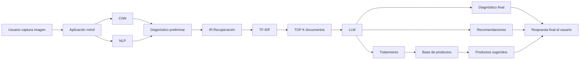
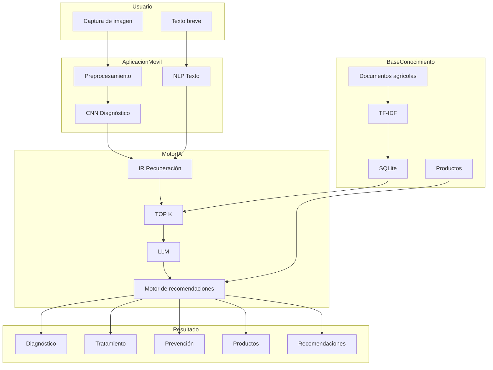
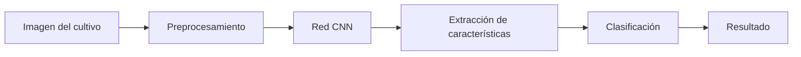
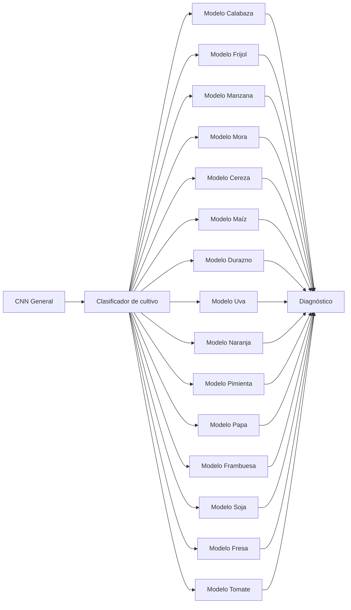
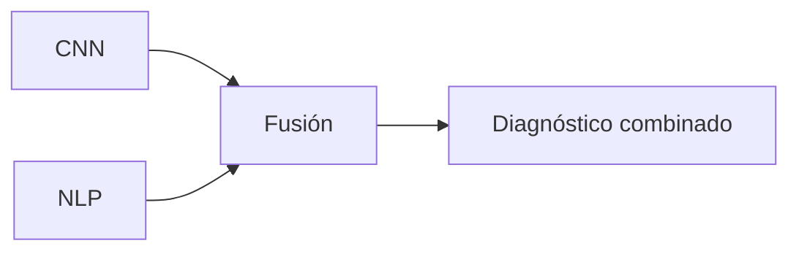
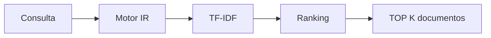
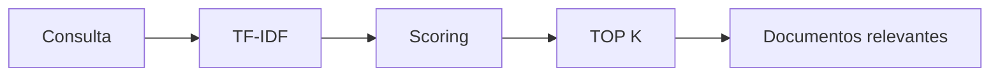
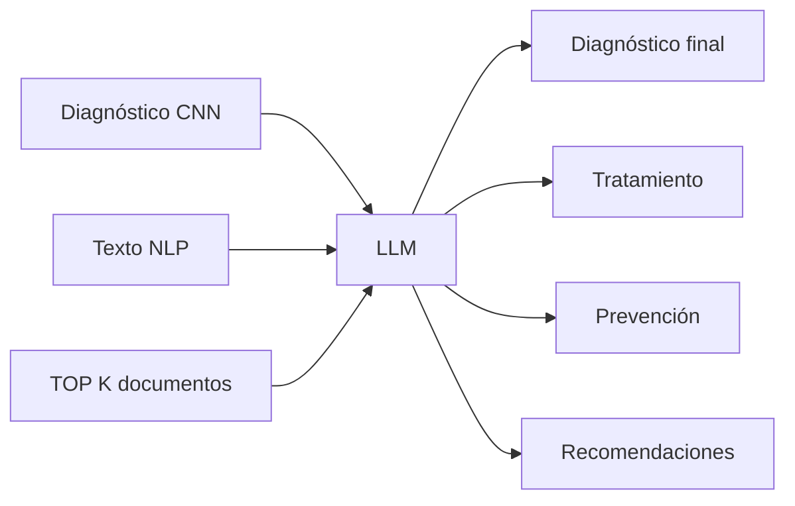
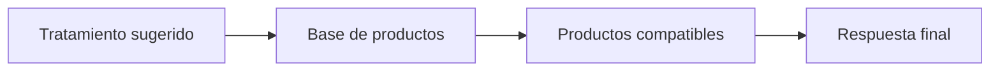
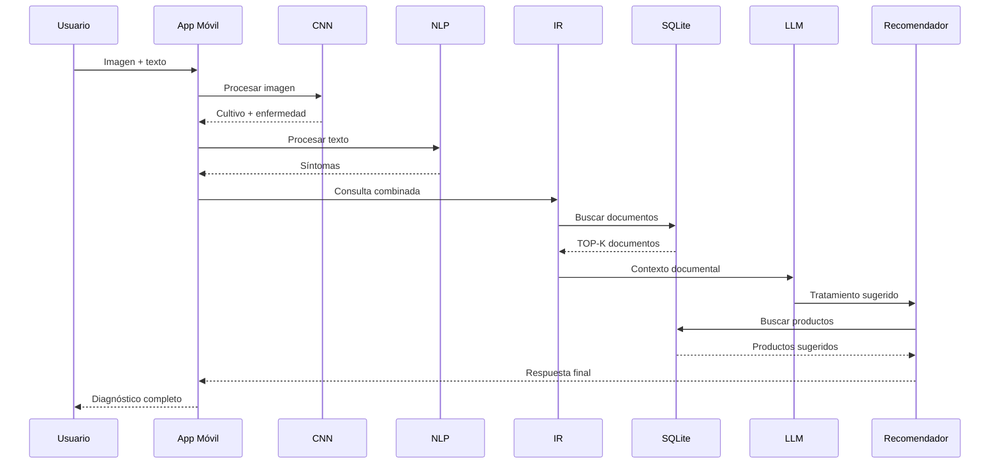

# SISTEMA INTELIGENTE DE DIAGNÓSTICO AGRÍCOLA MULTI-CULTIVO

# Arquitectura Completa del Sistema de Diagnóstico Inteligente para Cultivos

---

# 1. Objetivo General

Diseñar un sistema inteligente capaz de diagnosticar enfermedades, plagas y deficiencias nutricionales en múltiples cultivos agrícolas utilizando:

* Visión por computadora (CNN)
* Procesamiento de lenguaje natural (NLP)
* Recuperación de información (IR)
* TF-IDF
* Modelos de lenguaje (LLM)
* Base documental agrícola
* Sistema de recomendaciones
* Base de productos agrícolas
* SQLite para procesamiento local

El sistema será capaz de trabajar con 15 tipos de cultivos y generar diagnósticos inteligentes a partir de imágenes y texto ingresado por el usuario.

---

# 2. Cultivos Soportados

El sistema soporta los siguientes cultivos:

1. Calabaza
2. Frijol
3. Manzana
4. Mora
5. Cereza
6. Maíz
7. Durazno
8. Uva
9. Naranja
10. Pimienta
11. Papa
12. Frambuesa
13. Soja
14. Fresa
15. Tomate

---

# 3. Flujo General del Sistema



---

# 4. Arquitectura General del Sistema



---

# 5. Captura de Datos desde el Dispositivo Móvil

## Objetivo

Permitir que el agricultor o aprendiz capture información del cultivo afectado.

## Entradas del sistema

### Imagen

Fotografía de:

* Hojas
* Tallos
* Frutos
* Raíces
* Hongos
* Manchas
* Deficiencias nutricionales
* Plagas

### Texto breve

Ejemplos:

* “Las hojas tienen manchas amarillas”
* “La planta se está secando”
* “El fruto presenta puntos negros”
* “Las hojas tienen polvo blanco”

---

# 6. Módulo CNN — Visión por Computadora

## Objetivo

Analizar imágenes agrícolas para detectar:

* Cultivo
* Enfermedad
* Nivel de severidad
* Estrés hídrico
* Deficiencias
* Plagas

## Salida del CNN

El modelo CNN devuelve:

```json
{
  "cultivo": "Tomate",
  "enfermedad": "Tizón temprano",
  "confianza": 0.94
}
```

## Flujo del CNN



## Procesos Internos

### Preprocesamiento

* Redimensionamiento
* Normalización
* Eliminación de ruido
* Conversión de color
* Aumento de datos

### Arquitecturas recomendadas

* ResNet50
* EfficientNet
* MobileNet
* YOLO

---

# 7. Arquitectura Multi-Cultivo

El sistema está diseñado para trabajar con modelos especializados para cada cultivo.



---

# 8. NLP — Procesamiento de Lenguaje Natural

## Objetivo

Interpretar el texto ingresado por el usuario.

## Ejemplos

* “Las hojas tienen manchas amarillas”
* “La planta está marchita”
* “Hay hongos en el tallo”

## Procesos del NLP

### Limpieza del texto

* Eliminar caracteres especiales
* Convertir a minúsculas
* Corrección ortográfica

### Tokenización

```text
"hojas amarillas y secas"
```

↓

```text
["hojas", "amarillas", "secas"]
```

### Extracción semántica

El sistema detecta:

* síntomas
* severidad
* contexto
* tipo de daño
* condiciones ambientales

---

# 9. Integración CNN + NLP

## Objetivo

Combinar información visual y textual para mejorar precisión.

## Ejemplo

### Resultado CNN

```json
{
  "cultivo": "Tomate",
  "enfermedad": "Mildiu",
  "confianza": 0.72
}
```

### Resultado NLP

```text
"hojas amarillas y humedad"
```

## Resultado Final

```json
{
  "diagnostico": "Mildiu confirmado",
  "confianza": 0.89
}
```

## Flujo



---

# 10. IR — Recuperación de Información

## Objetivo

Buscar documentos relevantes relacionados con:

* enfermedades
* tratamientos
* fungicidas
* pesticidas
* fertilizantes
* prevención
* manejo agrícola

## Flujo IR



---

# 11. Base Documental

## Objetivo

Almacenar conocimiento agrícola.

## Contenido

```text
DOC1 → Enfermedades del tomate
DOC2 → Plagas del maíz
DOC3 → Roya en frijol
DOC4 → Mildiu en uva
DOCN → Tratamientos agrícolas
```

## Almacenamiento

* SQLite
* Archivos locales
* Base documental agrícola

---

# 12. TF-IDF para Ranking de Documentos

## Objetivo

Encontrar documentos relevantes según la consulta.

## Funcionamiento

TF-IDF calcula:

* importancia de palabras
* similitud
* peso contextual

## Ejemplo

Consulta:

```text
hojas amarillas tomate hongo
```

Resultado:

```text
TOP 1 → Mildiu del tomate
TOP 2 → Deficiencia de nitrógeno
TOP 3 → Roya temprana
```

---

# 13. Selección TOP-K

## Objetivo

Seleccionar los documentos más relevantes.

## Factores

* cultivo detectado
* tipo de usuario
* nivel de confianza
* síntomas detectados

## Tipos de usuario

### Agricultor

* respuestas simples
* recomendaciones directas

### Aprendiz

* explicaciones técnicas
* contenido educativo

## Flujo TOP-K



---

# 14. LLM — Modelo de Lenguaje

## Objetivo

Generar respuestas inteligentes contextualizadas.

## Entradas del LLM

* diagnóstico CNN
* síntomas NLP
* TOP-K documentos
* tratamientos
* productos agrícolas

## Salidas del LLM

* diagnóstico final
* explicación
* tratamiento
* recomendaciones
* prevención

## Flujo



---

# 15. Motor de Recomendaciones

## Objetivo

Sugerir acciones agrícolas inteligentes.

## Recomendaciones posibles

### Tratamientos

* fungicidas
* pesticidas
* fertilizantes

### Acciones

* podar
* reducir humedad
* aislar plantas
* modificar riego

### Prevención

* monitoreo
* control biológico
* rotación de cultivos

---

# 16. Base de Productos

## Objetivo

Relacionar tratamientos con productos reales.

## Información almacenada

```text
Producto
Marca
Ingrediente activo
Dosis
Aplicación
Compatibilidad
Precio
```

## Fuentes de información

* Web scraping
* APIs agrícolas
* Catálogos comerciales

## Flujo



---

# 17. Procesamiento Local y SQLite

## Objetivo

Permitir funcionamiento parcial offline.

## Componentes locales

* SQLite
* TF-IDF
* Caché documental
* Historial de consultas

## Beneficios

* menor latencia
* menor consumo de internet
* respuesta rápida
* funcionamiento offline parcial

---

# 18. Pipeline Completo del Sistema



---

# 19. Ejemplo de Respuesta Final del Sistema

```json
{
  "cultivo": "Tomate",
  "enfermedad": "Tizón temprano",
  "confianza": 0.93,
  "tratamiento": [
    "Aplicar fungicida",
    "Reducir humedad"
  ],
  "productos": [
    "Fungicida X",
    "Fertilizante Y"
  ],
  "prevencion": [
    "Rotación de cultivos",
    "Monitoreo semanal"
  ]
}
```

---

# 20. Resultado Esperado del Sistema

El sistema debe ser capaz de:

* Diagnosticar enfermedades agrícolas
* Analizar imágenes
* Interpretar texto
* Recomendar tratamientos
* Sugerir productos
* Recuperar información relevante
* Generar respuestas inteligentes
* Escalar a múltiples cultivos
* Funcionar parcialmente offline

---

# 21. Conclusión

La arquitectura propuesta integra:

* Visión por computadora
* NLP
* Recuperación documental
* Ranking TF-IDF
* Modelos de lenguaje
* Recomendaciones inteligentes

Todo esto permite construir un sistema avanzado de diagnóstico agrícola capaz de asistir agricultores y aprendices en tiempo real mediante inteligencia artificial.
