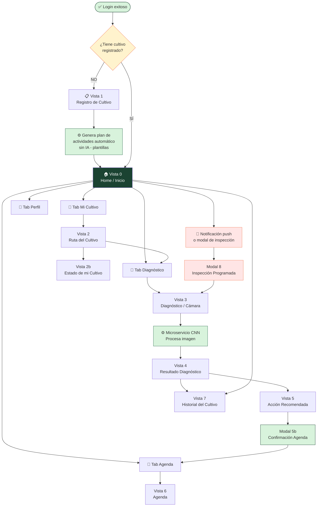
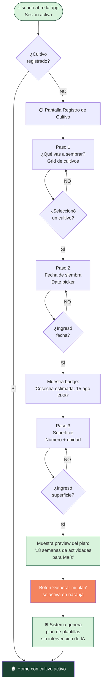
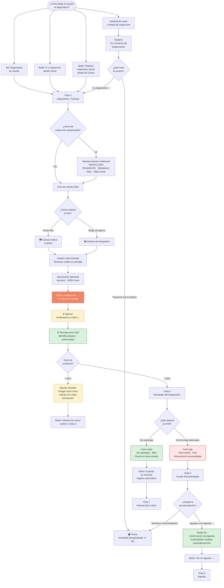
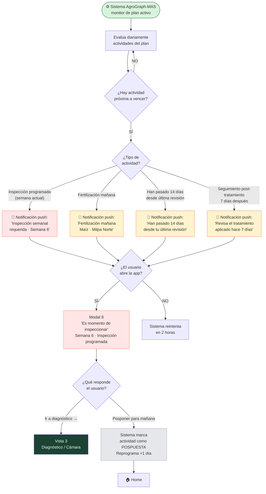
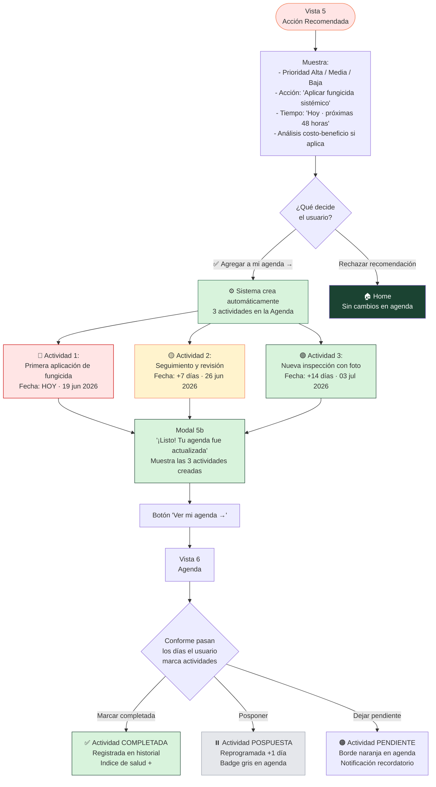
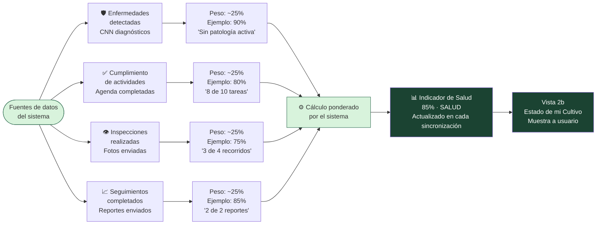
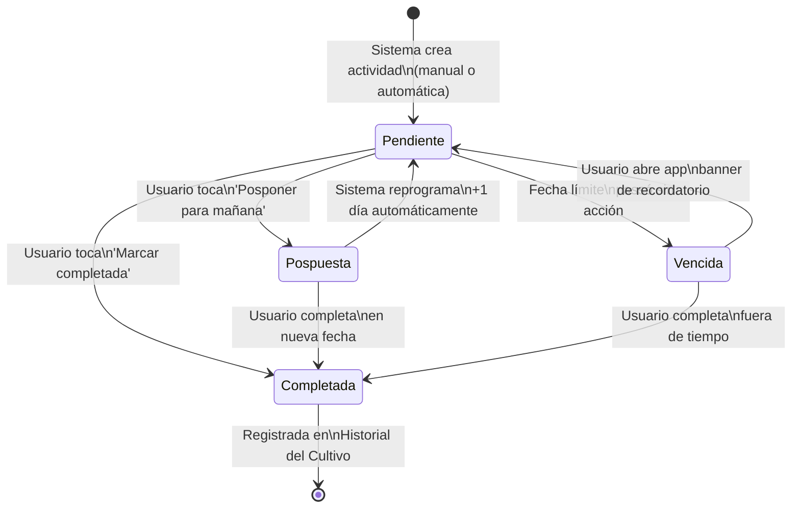
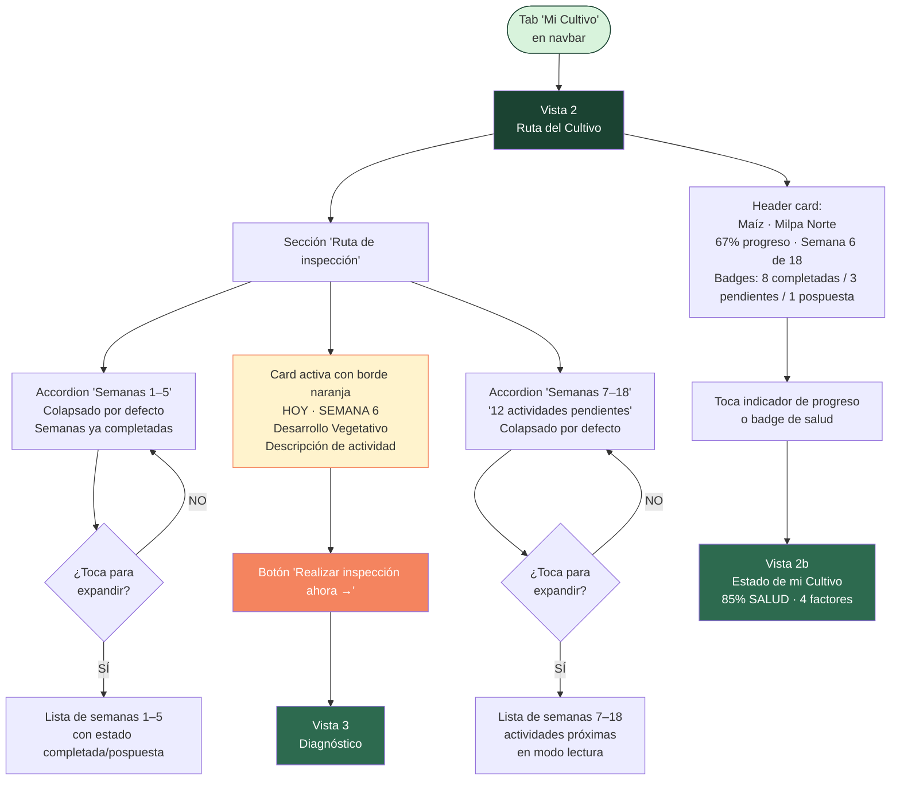
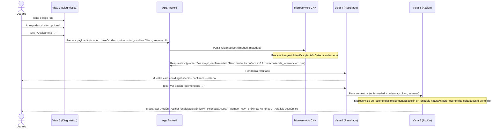

# Flujo de Vistas — Perfil Productor Guiado (Aprendiz)
> AgroGraph-MAS · Documento de referencia para maquetado
> Excluye: Login y Registro de cuenta (ya funciona). Incluye todo desde que el usuario entra con sesión activa.

---

## Sistema de diseño (tokens de referencia)

| Token | Valor |
|---|---|
| Verde oscuro (header/nav activo) | `#1B4332` |
| Verde medio (acciones primarias) | `#2D6A4F` |
| Verde claro (fondo tarjetas) | `#D8F3DC` |
| Naranja (CTA principal / alertas) | `#F4845F` |
| Amarillo suave (pendientes) | `#FFF3CD` |
| Rojo suave (detección enfermedad) | `#FFE5E5` |
| Fondo general | `#F0FAF3` |
| Texto principal | `#1A1A1A` |
| Texto secundario | `#6B7280` |
| Border-radius tarjeta | `12px` |
| Border-radius botón | `10px` |

**Navbar inferior (presente en TODAS las vistas principales):**
5 tabs: `Inicio` · `Diagnóstico` · `Mi Cultivo` · `Agenda` · `Perfil`
Ícono activo: verde oscuro `#1B4332`. El tab de **Mi Cultivo** usa ícono de planta 🌱.

---

## 1. Diagrama general — Mapa completo del sistema



---

## 2. Diagrama — Flujo de primera entrada (onboarding del cultivo)

> Ocurre una única vez: cuando el usuario entra por primera vez o no tiene cultivo registrado.



---

## 3. Diagrama — Flujo del ciclo de diagnóstico (núcleo del sistema)

> Este es el flujo más importante. Ocurre cada vez que el usuario realiza una inspección, ya sea programada o libre.



---

## 4. Diagrama — Flujo de notificaciones y recordatorios

> Describe cuándo y cómo el sistema interrumpe al usuario para guiarlo.



---

## 5. Diagrama — Flujo de aceptación de recomendación y creación de agenda

> Detalla exactamente qué pasa cuando el usuario acepta una recomendación post-diagnóstico.



---

## 6. Diagrama — Cálculo del indicador de salud del cultivo

> Muestra cómo se construye el porcentaje de salud que el usuario ve en Vista 2b.



---

## 7. Diagrama — Estados de una actividad en el ciclo de vida

> Muestra todos los estados posibles de una actividad en la Agenda y cómo transita entre ellos.



---

## 8. Diagrama — Flujo de la pantalla Mi Cultivo · Ruta del Cultivo

> Detalla la interacción dentro de la Vista 2 y sus sub-secciones.



---

## 9. Diagrama — Rol del microservicio CNN en el sistema

> Para claridad de implementación: qué envía la app, qué devuelve el CNN, cómo lo consume la UI.



---

## Vista 0 — Pantalla de Inicio (Home)

**Archivo sugerido:** `HomeProductorScreen`
**Punto de entrada:** Después de login exitoso con cultivo ya registrado.
**Si no tiene cultivo registrado** → redirige automáticamente a Vista 1.

```
┌─────────────────────────────────┐
│  [🌿 AgroGraph IA]        🔔   │  ← Header verde oscuro
│  Buenos días, [Nombre]          │
│  [Plan Free badge]              │
├─────────────────────────────────┤
│  ┌─────────────────────────┐    │
│  │ Mi cultivo · Maíz       │    │
│  │ Milpa Norte · 2.5 ha    │ 56%│  ← Círculo de progreso
│  │ Semana 6 de 18          │    │
│  │ ▓▓▓▓▓▓▒▒▒▒▒▒▒▒▒▒▒      │    │  ← Barra de progreso verde
│  └─────────────────────────┘    │
├─────────────────────────────────┤
│  📅 PRÓXIMA ACTIVIDAD    [HOY]  │  ← Badge naranja
│  Inspección semanal del cultivo │
│  [🔍 Ir a inspección →]         │  ← Botón naranja sólido
├─────────────────────────────────┤
│  [📍 Mi ruta] [📋 Historial] [📆 Agenda] │  ← 3 accesos rápidos
├─────────────────────────────────┤
│  Últimos eventos                │
│  • Inspección realizada - sin patología  06 jun │
│  • Fertilización pendiente               10 jun │
└─────────────────────────────────┘
[Inicio●] [Diagnóstico] [Mi Cultivo] [Agenda] [Perfil]
```

**Estados del card "PRÓXIMA ACTIVIDAD":**
- Sin actividad hoy → "Sin actividades pendientes hoy 🎉"
- Actividad vencida → badge rojo "VENCIDA"

---

## Vista 1 — Registro de Cultivo

**Archivo sugerido:** `RegistroCultivoScreen`
**Sin navbar inferior** (flujo de onboarding).

```
┌─────────────────────────────────┐
│  [🌿 AgroGraph IA]              │  ← Header verde oscuro
│  Registra tu cultivo            │
├─────────────────────────────────┤
│  Con estos 3 datos generamos tu │
│  plan de actividades automát.   │
├─────────────────────────────────┤
│  1. ¿Qué vas a sembrar?         │
│  ┌──────┐ ┌──────┐ ┌──────┐    │
│  │ 🌽   │ │ 🫘   │ │ 🍅   │    │  ← Seleccionado: fondo verde + borde verde
│  │ Maíz │ │Frijol│ │Jitomate│  │
│  └──────┘ └──────┘ └──────┘    │
│  ┌──────┐ ┌──────┐ ┌──────┐    │
│  │ 🌶️   │ │ 🥔   │ │ 🎃   │    │
│  │Chile │ │ Papa │ │Calabaza│  │
│  └──────┘ └──────┘ └──────┘    │
├─────────────────────────────────┤
│  2. Fecha de siembra            │
│  [📅 03/01/2026          ▾]     │
│  Cosecha estimada: 15 ago 2026  │  ← Badge verde claro
├─────────────────────────────────┤
│  3. Superficie                  │
│  [Ej. 5      ] [Hectáreas ▾]   │
├─────────────────────────────────┤
│  ╔═══════════════════════════╗  │
│  ║ Tu plan generará 18       ║  │  ← Aparece cuando 3 campos completos
│  ║ semanas para Maíz.        ║  │
│  ║ Sin IA — plantillas de    ║  │
│  ║ agrónomos.                ║  │
│  ╚═══════════════════════════╝  │
│  [🌱 Generar mi plan →]         │  ← Naranja, deshabilitado hasta completar
└─────────────────────────────────┘
```

---

## Vista 2 — Mi Cultivo · Ruta del Cultivo

**Archivo sugerido:** `MiCultivoScreen`
**Tab activo:** Mi Cultivo

```
┌─────────────────────────────────┐
│  [🌿 AgroGraph IA]         🔔   │
│  ✕ Modo fuera de línea          │  ← Banner amarillo (condicional)
├─────────────────────────────────┤
│  Mi Cultivo · Maíz              │
│  Milpa Norte                    │
│  ○ 67%      Semana 6 de 18      │  ← Toca para ir a Vista 2b
│  📅 Cosecha: 15 ago 2026        │
│  [8 COMPL.] [3 PEND.] [1 POSP.] │
├─────────────────────────────────┤
│  RUTA DE INSPECCIÓN             │
│  [Semanas 1 - 5  ▾]             │  ← Accordion colapsado
│                                 │
│  ┌─────────────────────────┐    │
│  │ HOY · SEMANA 6       🌱 │    │  ← Borde naranja, card activa
│  │ Desarrollo Vegetativo   │    │
│  │ Monitorear aparición de │    │
│  │ hojas nuevas...         │    │
│  │ [Realizar inspección →] │    │  ← Botón naranja
│  └─────────────────────────┘    │
│                                 │
│  12 actividades pendientes ▾    │  ← Accordion semanas futuras
└─────────────────────────────────┘
[Inicio] [Diagnóstico] [Mi Cultivo●] [Agenda] [Perfil]
```

---

## Vista 2b — Estado de mi Cultivo

**Archivo sugerido:** `EstadoCultivoScreen`
**Acceso:** Desde indicador de progreso en Mi Cultivo o Home.

```
┌─────────────────────────────────┐
│  ← Estado de mi cultivo        │
├─────────────────────────────────┤
│         ╔═══════╗               │
│         ║  85%  ║               │  ← Círculo animado
│         ║ SALUD ║               │
│         ╚═══════╝               │
│      Maíz · Milpa Norte         │
│      📅 Semana 6                │
├─────────────────────────────────┤
│  🛡️ Enfermedades detectadas  90%│
│  ▓▓▓▓▓▓▓▓▓░  Sin patología activa│
│                                 │
│  ✅ Cumplimiento actividades  80%│
│  ▓▓▓▓▓▓▓▓░░  8 de 10 tareas    │
│                                 │
│  👁️ Inspecciones realizadas  75%│
│  ▓▓▓▓▓▓▓░░░  3 de 4 recorridos │
│                                 │
│  📈 Seguimientos completados 85%│
│  ▓▓▓▓▓▓▓▓▓░  2 de 2 reportes   │
├─────────────────────────────────┤
│  ℹ️ Indicadores actualizados     │
│  con las últimas sincronizaciones│
└─────────────────────────────────┘
[Inicio] [Diagnóstico] [Mi Cultivo●] [Agenda] [Perfil]
```

---

## Vista 3 — Diagnóstico (Cámara / Captura)

**Archivo sugerido:** `DiagnosticoScreen`
**Tab activo:** Diagnóstico

```
┌─────────────────────────────────┐
│  [🌿 AgroGraph IA]         🕐   │
│  ☰  Diagnóstico                 │
├─────────────────────────────────┤
│  [Analizar ●]  [Mis diagnósticos]│  ← Tabs internos
├─────────────────────────────────┤
│  ╔═══════════════════════════╗  │
│  ║ 🟠 INSPECCIÓN PENDIENTE   ║  │  ← Solo si viene de plan/notif
│  ║    · SEMANA 6             ║  │
│  ║ Maíz · Milpa Norte        ║  │
│  ║ Tu plan indica que es     ║  │
│  ║ momento de revisar.       ║  │
│  ║ [Ir a inspección →]       ║  │
│  ╚═══════════════════════════╝  │
│  — O REALIZA UN DIAGNÓSTICO LIBRE —│
│                                 │
│         📷                      │
│    Fotografía lo que ves        │
│  Cualquier planta o cultivo     │
├─────────────────────────────────┤
│  [   Tomar foto   ]             │  ← Naranja sólido
│  [  Elegir de galería  ]        │  ← Naranja outline
├─────────────────────────────────┤
│  Información adicional (opcional)│
│  [ Describe lo que observas 0/300]│
├─────────────────────────────────┤
│  [  Primero agrega una foto  ]  │  ← Deshabilitado / gris
└─────────────────────────────────┘
[Inicio] [Diagnóstico●] [Mi Cultivo] [Agenda] [Perfil]
```

---

## Vista 4 — Resultado del Diagnóstico

**Archivo sugerido:** `ResultadoDiagnosticoScreen`
**Acceso:** Automático tras procesar foto en Vista 3.

```
┌─────────────────────────────────┐
│  ← Resultado del diagnóstico   │
├─────────────────────────────────┤
│  [Miniatura foto tomada]        │  ← 180px altura
│                                 │
│  Planta identificada:           │
│  🌽 Maíz (Zea mays)            │
├─────────────────────────────────┤
│  DIAGNÓSTICO                    │
│                                 │
│  ╔═══════════════════════════╗  │  ← Card roja si enfermedad
│  ║ 🔴 Tizón tardío detectado ║  │
│  ║ Confianza: 91%            ║  │
│  ║ Intervención recomendada  ║  │
│  ╚═══════════════════════════╝  │
│                                 │  ← Card verde si sano
│  ╔═══════════════════════════╗  │
│  ║ ✅ Sin patología detectada║  │
│  ║ Confianza: 88%            ║  │
│  ╚═══════════════════════════╝  │
├─────────────────────────────────┤
│  [Ver acción recomendada →]     │  ← Naranja sólido
│  [Guardar en historial]         │  ← Verde outline
└─────────────────────────────────┘
```

**Si confianza < 60%:**
→ Banner amarillo + botón "Intentar de nuevo"

---

## Vista 5 — Acción Recomendada

**Archivo sugerido:** `AccionRecomendadaScreen`

```
┌─────────────────────────────────┐
│  ← Acción recomendada          │
│  Basado en: Tizón tardío        │
│  Maíz · Semana 6 · Milpa Norte  │
├─────────────────────────────────┤
│  ╔═══════════════════════════╗  │
│  ║ 🔴 PRIORIDAD ALTA         ║  │
│  ║                           ║  │
│  ║ Aplicar fungicida         ║  │
│  ║ sistémico                 ║  │
│  ║                           ║  │
│  ║ ⏱️ Hoy · próximas 48h     ║  │
│  ╚═══════════════════════════╝  │
│                                 │
│  ╔═══════════════════════════╗  │
│  ║ 💰 ¿Conviene económicamente?║ │  ← Solo si aplica por cultivo/región
│  ║ Costo tratamiento: ~$320  ║  │
│  ║ Pérdida sin trat: $1,800  ║  │
│  ║ ✅ Tratamiento recomendado ║  │
│  ╚═══════════════════════════╝  │
├─────────────────────────────────┤
│  [✅ Agregar a mi agenda →]     │  ← Naranja sólido
│  [Rechazar recomendación]       │  ← Texto gris
└─────────────────────────────────┘
```

---

## Vista 5b — Modal Confirmación de Agenda

**Tipo:** Modal sobre fondo oscurecido.

```
│  ░░░░░░░ fondo oscurecido ░░░░  │
│  ┌───────────────────────────┐  │
│  │  ✅ ¡Listo! Tu agenda fue │  │
│  │     actualizada           │  │
│  │  3 actividades creadas:   │  │
│  │  🔴 Primera aplicación    │  │
│  │     fungicida · HOY       │  │
│  │  🟡 Seguimiento y revisión│  │
│  │     26 jun 2026           │  │
│  │  🟢 Nueva inspección foto │  │
│  │     03 jul 2026           │  │
│  │  Recibirás recordatorios. │  │
│  │  [Ver mi agenda →]        │  │  ← Verde oscuro sólido
│  └───────────────────────────┘  │
```

---

## Vista 6 — Agenda

**Archivo sugerido:** `AgendaScreen`
**Tab activo:** Agenda

```
┌─────────────────────────────────┐
│  [🌿 AgroGraph IA]         🔔   │
│  Mi Agenda                      │
├─────────────────────────────────┤
│  [◀ Jun 2026 ▶]                 │
│  L  M  X  J  V  S  D           │
│  ...  19● 20 21 22 ...         │  ← Punto naranja = actividad
├─────────────────────────────────┤
│  HOY · 19 junio                 │
│  ┌─────────────────────────┐    │
│  │ 🔴 Primera aplicación   │    │
│  │    de fungicida         │    │
│  │ Maíz · Milpa Norte      │    │
│  │ [Marcar completada]     │    │
│  └─────────────────────────┘    │
│  PRÓXIMOS                       │
│  ┌─────────────────────────┐    │
│  │ 🟡 26 jun · Seguimiento │    │
│  └─────────────────────────┘    │
│  ┌─────────────────────────┐    │
│  │ 🟢 03 jul · Inspección  │    │
│  └─────────────────────────┘    │
└─────────────────────────────────┘
[Inicio] [Diagnóstico] [Mi Cultivo] [Agenda●] [Perfil]
```

---

## Vista 7 — Historial del Cultivo

**Archivo sugerido:** `HistorialCultivoScreen`

```
┌─────────────────────────────────┐
│  ← Mi historial                │
│  Generado automáticamente.     │
├─────────────────────────────────┤
│  🟢 Siembra                15 Mar│
│  Maíz H-59 · 2.5 ha · Milpa Norte│
│  👁️ Inspección sin patología  22 Mar│
│  💧 Fertilización            05 Abr│
│  👁️ Inspección semana 5     19 Abr│
│  🔴 Detección de enfermedad  25 Abr│  ← Card fondo rojo suave
│     Tizón tardío · 91% · intervención│
│  🟠 Tratamiento aplicado    26 Abr│
│     Metalaxil 1.5 ml/L            │
│  📈 Mejora observada        03 May│
│  ✅ Seguimiento completado  10 May│
│  👁️ Inspección semana 10   17 May│
│  ⏸️ Fertilización pospuesta  06 Jun│  ← Card gris
└─────────────────────────────────┘
[Inicio] [Diagnóstico] [Mi Cultivo●] [Agenda] [Perfil]
```

---

## Vista 8 — Modal de Inspección Programada

**Tipo:** Modal / bottom sheet al abrir app con inspección pendiente.

```
│  ░░░░░░░ fondo oscurecido ░░░░  │
│  ┌───────────────────────────┐  │
│  │         🌱                │  │
│  │  Es momento de            │  │
│  │  inspeccionar             │  │
│  │  Semana 6 · Inspección    │  │
│  │  programada               │  │
│  │  Toma una foto de tus     │  │
│  │  plantas para que el      │  │
│  │  modelo de IA analice.    │  │
│  │  [Hoy · 19 jun 2026]      │  │  ← Badge verde claro
│  │  [Ir a diagnóstico →]     │  │  ← Naranja sólido
│  │  [Posponer para mañana]   │  │  ← Outline
│  └───────────────────────────┘  │
```

---

## Reglas de navegación

1. **Header siempre muestra "AgroGraph IA"** en todas las pantallas.
2. **Tab activo** resaltado en verde oscuro `#1B4332`.
3. Subpantallas (2b, 4, 5, 5b, 7, 8) heredan el tab activo de su pantalla padre.
4. **CTA principal**: siempre naranja sólido `#F4845F` con texto blanco.
5. **Botones secundarios**: outline naranja o verde.
6. Banner contextual en Vista 3 se muestra **siempre** si el usuario viene de inspección programada.
7. Flujo CNN: foto → spinner "Analizando tu cultivo..." → resultado. La app solo consume la respuesta del microservicio existente.

---

## Componentes reutilizables

| Componente | Usado en |
|---|---|
| `CultivoBadge` | Home, Mi Cultivo, Historial |
| `ProgresoCircular` | Home, Mi Cultivo, Estado 2b |
| `BarraProgresoLineal` | Home, Estado 2b |
| `ActividadCard` | Agenda, Mi Cultivo |
| `EventoHistorial` | Historial |
| `ModalBottomSheet` | Modal 8, Modal 5b |
| `BannerContextual` | Vista 3 (inspección pendiente) |
| `SelectorCultivo` | Registro de cultivo |
| `IndicadorFactor` | Estado 2b |

---

*AgroGraph-MAS · Perfil Productor Guiado · Flujo de vistas para maquetado*