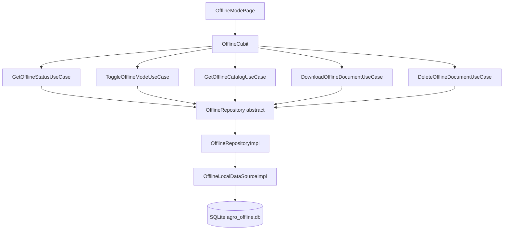
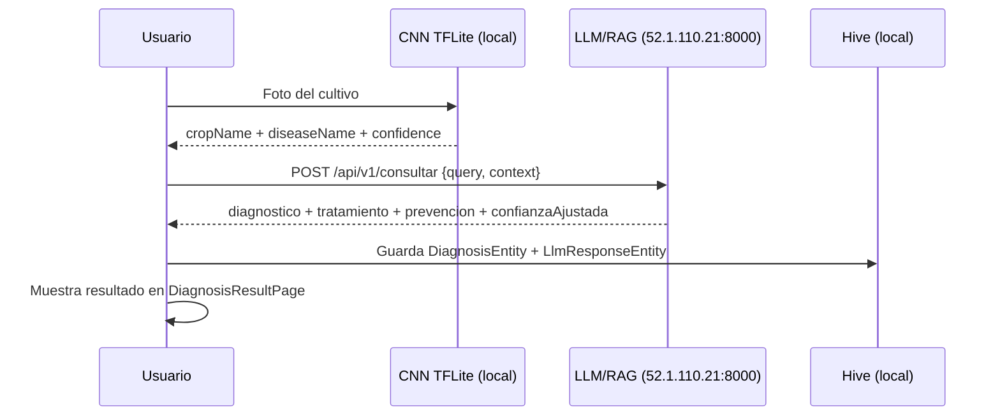
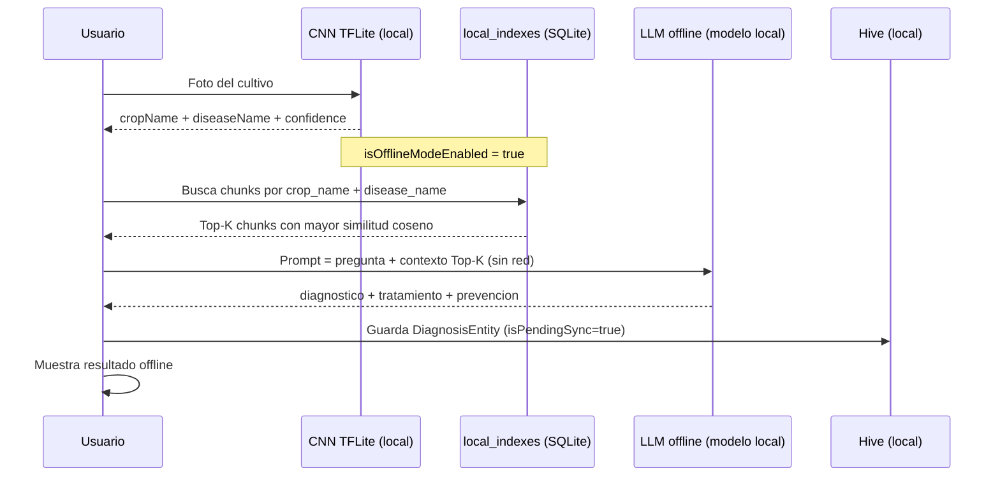
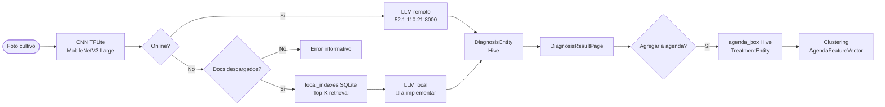

# AgroGraph-MAS — Arquitectura Offline + Perfil de Usuario

> **Audiencia:** Equipo móvil · Equipo backend · Equipo LLM/RAG · Equipo de clustering  
> **Estado:** Base técnica implementada — puntos de integración LLM marcados con 🔌

---

## Tabla de Contenidos

1. [Resumen Ejecutivo](#1-resumen-ejecutivo)
2. [Arquitectura de la Feature Offline](#2-arquitectura-de-la-feature-offline)
3. [Flujo Online vs Offline](#3-flujo-online-vs-offline)
4. [Esquema SQLite](#4-esquema-sqlite)
5. [Pipeline de Retrieval Local (Top-K)](#5-pipeline-de-retrieval-local-top-k)
6. [Puntos de Integración para el Equipo LLM](#6-puntos-de-integración-para-el-equipo-llm)
7. [Feature de Perfil de Usuario](#7-feature-de-perfil-de-usuario)
8. [Estructuras de Datos](#8-estructuras-de-datos)
9. [Escalabilidad](#9-escalabilidad)

---

## 1. Resumen Ejecutivo

La feature **Offline Mode** permite que AgroGraph-MAS realice diagnósticos fitosanitarios incluso sin conexión a internet. El flujo completo es:

```
CNN (local TFLite) → Top-K documentos en SQLite → LLM offline → Diagnóstico
```

La feature de **Perfil de Usuario** expone el estado offline y las estadísticas de almacenamiento directamente al agricultor, con acceso a la gestión completa desde `OfflineModePage`.

---

## 2. Arquitectura de la Feature Offline

### 2.1 Capas (Clean Architecture)

```
lib/features/offline/
├── domain/
│   ├── entities/
│   │   ├── offline_document_entity.dart   ← OfflineDocumentEntity
│   │   └── offline_status_entity.dart     ← OfflineStatusEntity
│   ├── repositories/
│   │   └── offline_repository.dart        ← contrato abstracto
│   └── usecases/
│       └── offline_usecases.dart          ← 5 casos de uso
├── data/
│   ├── models/
│   │   └── offline_document_model.dart    ← fromRow() / toRow() SQLite
│   ├── datasources/
│   │   └── offline_local_datasource.dart  ← SQLite + catálogo mock
│   └── repositories/
│       └── offline_repository_impl.dart   ← implementación con Either<>
└── presentation/
    ├── cubit/
    │   └── offline_cubit.dart             ← OfflineCubit + sealed states
    └── pages/
        └── offline_mode_page.dart         ← UI completa
```

### 2.2 Diagrama de dependencias



### 2.3 Estados del OfflineCubit

```dart
sealed class OfflineState
  OfflineInitial    → antes de cargar
  OfflineLoading    → cargando DB
  OfflineLoaded     → datos listos
    .status                 ← OfflineStatusEntity
    .documents              ← List<OfflineDocumentEntity>
    .downloadingDocId       ← String? (null = sin descarga activa)
  OfflineError      → error
    .message
```

---

## 3. Flujo Online vs Offline

### 3.1 Con internet (flujo actual completo)



### 3.2 Sin internet (flujo offline — a implementar con el equipo LLM)



### 3.3 Fallback y sincronización

| Condición | Comportamiento |
|-----------|----------------|
| Online, modo offline desactivado | Flujo LLM remoto (actual) |
| Online, modo offline activado | Flujo offline (SQLite local) |
| Sin internet, sin documentos descargados | Error informativo — "Descarga documentos para diagnóstico offline" |
| Sin internet, con documentos descargados | Flujo offline completo |
| Reconecta con diagnósticos pendientes | `isPendingSync = true` → sincronizar con backend |

---

## 4. Esquema SQLite

**Base de datos:** `agro_offline.db` (en `getDatabasesPath()`)

### 4.1 Tabla `offline_documents`

```sql
CREATE TABLE offline_documents (
  id            TEXT PRIMARY KEY,       -- Ej: 'doc_tomato_lateblight'
  crop_name     TEXT NOT NULL,          -- Ej: 'Tomate'
  disease_name  TEXT NOT NULL,          -- Ej: 'Tizón tardío'
  title         TEXT NOT NULL,          -- Título del documento
  content       TEXT NOT NULL,          -- Texto completo (para chunking RAG)
  source        TEXT NOT NULL,          -- Ej: 'FAO-2023'
  embedding_json TEXT DEFAULT '[]',     -- 🔌 Float[] del embedding global
  size_bytes    INTEGER DEFAULT 0,      -- Tamaño real tras descarga
  status        TEXT DEFAULT 'available', -- available|downloading|downloaded|error
  downloaded_at TEXT,                   -- ISO 8601
  version       TEXT DEFAULT '1.0',
  created_at    TEXT NOT NULL
);
```

### 4.2 Tabla `local_indexes` (RAG offline)

```sql
CREATE TABLE local_indexes (
  id             TEXT PRIMARY KEY,
  document_id    TEXT NOT NULL,         -- FK → offline_documents.id
  chunk_index    INTEGER NOT NULL,      -- Posición del chunk (0, 1, 2, ...)
  chunk_text     TEXT NOT NULL,         -- Texto del chunk (~512 tokens)
  embedding_json TEXT DEFAULT '[]',     -- 🔌 Float[] del embedding del chunk
  created_at     TEXT NOT NULL,
  FOREIGN KEY (document_id)
    REFERENCES offline_documents(id) ON DELETE CASCADE
);
```

### 4.3 Tabla `sync_status`

```sql
CREATE TABLE sync_status (
  id               INTEGER PRIMARY KEY,  -- Siempre 1 (singleton)
  is_offline_mode  INTEGER DEFAULT 0,    -- 0=off 1=on
  last_sync_at     TEXT,                 -- ISO 8601
  last_modified    TEXT NOT NULL
);
```

### 4.4 Tabla `download_queue`

```sql
CREATE TABLE download_queue (
  id            TEXT PRIMARY KEY,
  document_id   TEXT NOT NULL,
  progress      REAL DEFAULT 0.0,        -- 0.0 - 1.0
  status        TEXT DEFAULT 'queued',   -- queued|downloading|completed|failed
  error_message TEXT,
  created_at    TEXT NOT NULL
);
```

---

## 5. Pipeline de Retrieval Local (Top-K)

Este pipeline es preparatorio. El equipo LLM conectará el motor de embeddings real.

### 5.1 Flujo de indexación (al descargar un documento)

```
1. GET /api/v1/offline/documents/{id}
      ↓
2. Recibir: {content, embedding_json, chunks[]}
      ↓
3. Para cada chunk:
   INSERT INTO local_indexes (id, document_id, chunk_index, chunk_text, embedding_json)
      ↓
4. UPDATE offline_documents SET status='downloaded', size_bytes=N
```

### 5.2 Flujo de retrieval (en diagnóstico offline)

```
1. CNN → cropName, diseaseName
      ↓
2. SELECT chunk_text, embedding_json
   FROM local_indexes li
   JOIN offline_documents od ON od.id = li.document_id
   WHERE od.crop_name = ? AND od.disease_name = ?
      ↓
3. Para cada chunk: calcular similitud coseno con embedding de la query
   score = dot(queryEmbedding, chunkEmbedding)
      ↓
4. Ordenar por score DESC → Top-K chunks (K=3 por defecto)
      ↓
5. Concatenar chunk_text como contexto del prompt LLM
```

### 5.3 Similitud coseno en Dart

```dart
// lib/features/offline/data/services/embedding_service.dart (a implementar)
double cosineSimilarity(List<double> a, List<double> b) {
  assert(a.length == b.length);
  double dot = 0, normA = 0, normB = 0;
  for (int i = 0; i < a.length; i++) {
    dot   += a[i] * b[i];
    normA += a[i] * a[i];
    normB += b[i] * b[i];
  }
  return dot / (sqrt(normA) * sqrt(normB));
}
```

### 5.4 Chunking recomendado

| Parámetro | Valor recomendado |
|-----------|------------------|
| Tamaño de chunk | 400–512 tokens (~1800 caracteres) |
| Overlap | 50 tokens (~225 caracteres) |
| Separador | Párrafo (`\n\n`) o oración |
| Estrategia | Recursive character text splitter |

---

## 6. Puntos de Integración para el Equipo LLM

### 🔌 Punto 1 — Catálogo de documentos disponibles

**Archivo:** `lib/features/offline/data/datasources/offline_local_datasource.dart`  
**Método:** `_mockCatalog()` → reemplazar por llamada HTTP real

```dart
// ANTES (mock):
static List<OfflineDocumentModel> _mockCatalog(DateTime now) => [
  OfflineDocumentModel(id: 'doc_tomato_lateblight', ...),
  // ...
];

// DESPUÉS (equipo LLM implementa):
Future<List<OfflineDocumentModel>> fetchRemoteCatalog() async {
  final response = await dio.get('/api/v1/offline/catalog');
  return (response.data['documents'] as List)
      .map((e) => OfflineDocumentModel.fromJson(e))
      .toList();
}
```

**Contrato del endpoint:**
```typescript
// GET /api/v1/offline/catalog
interface CatalogResponse {
  documents: {
    id: string;
    crop_name: string;
    disease_name: string;
    title: string;
    source: string;
    size_bytes: number;
    version: string;
  }[];
}
```

---

### 🔌 Punto 2 — Descarga de documento + embeddings

**Archivo:** `lib/features/offline/data/repositories/offline_repository_impl.dart`  
**Método:** `downloadDocument(String documentId)` → reemplazar el `Future.delayed` simulado

```dart
// ANTES (simulación):
await Future.delayed(const Duration(milliseconds: 1500));

// DESPUÉS (equipo LLM implementa):
final response = await dio.get('/api/v1/offline/documents/$documentId');
final data = response.data as Map<String, dynamic>;

// 1. Guardar chunks en local_indexes
for (final chunk in data['chunks'] as List) {
  await db.insert('local_indexes', {
    'id': chunk['id'],
    'document_id': documentId,
    'chunk_index': chunk['index'],
    'chunk_text': chunk['text'],
    'embedding_json': jsonEncode(chunk['embedding']),
    'created_at': DateTime.now().toIso8601String(),
  });
}

// 2. Actualizar tamaño real
await _dataSource.setDocumentStatus(
  documentId, 'downloaded',
  downloadedAt: DateTime.now(),
  sizeBytes: data['size_bytes'] as int,
);
```

**Contrato del endpoint:**
```typescript
// GET /api/v1/offline/documents/{id}
interface DocumentDownloadResponse {
  id: string;
  content: string;          // Texto completo del documento
  size_bytes: number;
  embedding: number[];      // Embedding global del documento (dim=768)
  chunks: {
    id: string;             // UUID único del chunk
    index: number;          // Posición (0, 1, 2, ...)
    text: string;           // Texto del chunk (~512 tokens)
    embedding: number[];    // Embedding del chunk (dim=768)
  }[];
}
```

---

### 🔌 Punto 3 — Retrieval local en diagnóstico offline

**Archivo a crear:** `lib/features/offline/data/services/local_retrieval_service.dart`

```dart
// Interface que el equipo LLM debe implementar:
abstract interface class LocalRetrievalService {
  /// Devuelve los K chunks más relevantes para una query dada.
  /// 
  /// [queryEmbedding] debe generarse con el mismo modelo que los chunks.
  /// Si no hay embeddings, usa búsqueda por palabras clave (fallback).
  Future<List<RetrievalChunk>> retrieveTopK({
    required String cropName,
    required String diseaseName,
    required List<double> queryEmbedding,
    int k = 3,
  });
}

class RetrievalChunk {
  final String documentId;
  final String chunkText;
  final double similarityScore;
  const RetrievalChunk({
    required this.documentId,
    required this.chunkText,
    required this.similarityScore,
  });
}
```

---

### 🔌 Punto 4 — Diagnóstico LLM offline

**Archivo:** `lib/features/diagnosis/data/datasources/llm_diagnosis_datasource.dart`  
**Hook de integración:**

```dart
// En LlmDiagnosisDataSourceImpl.getLlmDiagnosis():
// El equipo LLM debe verificar:
//   1. isOfflineModeEnabled (leer de OfflineRepository)
//   2. Si offline → usar LocalRetrievalService + modelo local (llama.cpp / mlc-llm)
//   3. Si online  → usar endpoint remoto actual (http://52.1.110.21:8000)

Future<LlmResponseEntity> getLlmDiagnosis({...}) async {
  final isOffline = await offlineRepo.getStatus().then(
    (r) => r.fold((_) => false, (s) => s.isOfflineModeEnabled),
  );

  if (isOffline) {
    // 🔌 EQUIPO LLM: conectar modelo local aquí
    final chunks = await localRetrievalService.retrieveTopK(
      cropName: cropName,
      diseaseName: diseaseName,
      queryEmbedding: await embeddingService.embed(query),
    );
    final context = chunks.map((c) => c.chunkText).join('\n\n');
    return await localLlmService.diagnose(query: query, context: context);
  }

  // Flujo online actual
  return await _remoteCall(query);
}
```

---

## 7. Feature de Perfil de Usuario

### 7.1 Datos mostrados

| Campo | Fuente | Fallback |
|-------|--------|---------|
| Nombre | `UserEntity.fullName` | `username` |
| Email / Teléfono | `UserEntity.email ?? phone` | "Agricultor" |
| Iniciales avatar | Primeras letras de `fullName` | "AG" |
| Estado offline | `OfflineCubit.state.status.isOfflineModeEnabled` | false |
| Docs descargados | `OfflineCubit.state.status.downloadedCount` | 0 |
| Almacenamiento | `OfflineCubit.state.status.usedBytesLabel` | "0 B" |

### 7.2 Navegación desde Perfil

```
ProfilePage
  ├── Switch "Modo sin conexión" → OfflineCubit.toggleOfflineMode()
  ├── ListTile "Almacenamiento local" → OfflineModePage
  └── Zona de peligro → AuthBloc.AuthLogoutRequested → SelectProfilePage
```

### 7.3 UserEntity disponible

```dart
// Acceso en cualquier widget:
final authState = context.read<AuthBloc>().state;
if (authState is AuthAuthenticated) {
  final user = authState.user;
  print(user.id);        // UUID del backend
  print(user.fullName);  // Nombre completo
  print(user.email);     // nullable
  print(user.role);      // "agricultor" | "aprendiz_agricola"
}
```

---

## 8. Estructuras de Datos

### 8.1 OfflineDocumentEntity

```typescript
interface OfflineDocumentEntity {
  id: string;
  cropName: string;
  diseaseName: string;
  title: string;
  content: string;           // Texto completo (solo en memoria tras descarga)
  source: string;            // Referencia bibliográfica
  sizeBytes: number;
  status: 'available' | 'downloading' | 'downloaded' | 'error';
  downloadedAt: string | null;   // ISO 8601
  version: string;
  createdAt: string;             // ISO 8601

  // Getters calculados:
  isDownloaded: boolean;
  isDownloading: boolean;
  sizeLabel: string;             // "148.0 KB", "2.1 MB"
}
```

### 8.2 OfflineStatusEntity

```typescript
interface OfflineStatusEntity {
  isOfflineModeEnabled: boolean;
  downloadedCount: number;
  totalAvailableCount: number;
  usedBytes: number;
  lastSyncAt: string | null;     // ISO 8601

  // Getter:
  usedBytesLabel: string;        // "12.4 MB"
}
```

### 8.3 OfflineLoaded state (Cubit)

```typescript
interface OfflineLoaded {
  status: OfflineStatusEntity;
  documents: OfflineDocumentEntity[];
  downloadingDocId: string | null;   // Descarga activa
}
```

### 8.4 Mermaid — Flujo completo de datos



---

## 9. Escalabilidad

### 9.1 Limitaciones actuales

| Limitación | Impacto | Solución |
|-----------|---------|----------|
| Catálogo hardcoded (mock) | No refleja documentos reales | Endpoint `/api/v1/offline/catalog` |
| Descarga simulada (delay) | No baja contenido real | Endpoint `/api/v1/offline/documents/{id}` |
| Sin embeddings reales | Retrieval por palabras clave solo | Modelo de embeddings + pgvector backend |
| Sin LLM local | Offline sin diagnóstico LLM | mlc-llm / llama.cpp en dispositivo |

### 9.2 Hoja de ruta de integración

```
Sprint actual (COMPLETADO):
  ✓ Arquitectura Clean Architecture offline feature
  ✓ SQLite con 4 tablas (documentos, índices, cola, estado)
  ✓ Catálogo mock de 10 documentos fitosanitarios
  ✓ UI completa: toggle, stats, lista por cultivo, descarga/eliminar
  ✓ ProfilePage conectada a UserEntity real + OfflineCubit
  ✓ OfflineCubit global en MultiBlocProvider

Sprint siguiente (EQUIPO LLM):
  □ Implementar GET /api/v1/offline/catalog
  □ Implementar GET /api/v1/offline/documents/{id} con chunks + embeddings
  □ Implementar LocalRetrievalService con similitud coseno
  □ Integrar modelo LLM local (mlc-llm recomendado para Flutter)
  □ Modificar LlmDiagnosisDataSource para routing online/offline

Sprint futuro:
  □ Sincronización de diagnósticos pendientes (isPendingSync=true)
  □ Actualización incremental del catálogo (versionado)
  □ Descarga en background con WorkManager
  □ Notificación cuando el catálogo tiene nuevas versiones
```

### 9.3 Tecnologías recomendadas para LLM offline

| Componente | Recomendación | Razón |
|-----------|--------------|-------|
| LLM local | mlc-llm (Flutter plugin) | Soporte nativo Android/iOS, modelos quantizados |
| Embeddings | sentence-transformers (servidor) o on-device FastEmbed | Dim=384 para dispositivos limitados |
| Modelo base | Llama 3.2 1B / Gemma 2B (quantizado INT4) | Cabe en 1-2 GB RAM |
| Almacenamiento vectores | SQLite + coseno en Dart | Sin dependencias externas |

---

*Documento generado el 2026-07-01 · Refleja el estado de `lib/features/offline/` y `lib/features/profile/` del proyecto AgroGraph-MAS.*
